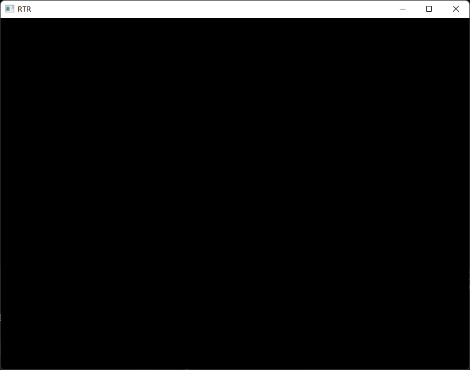
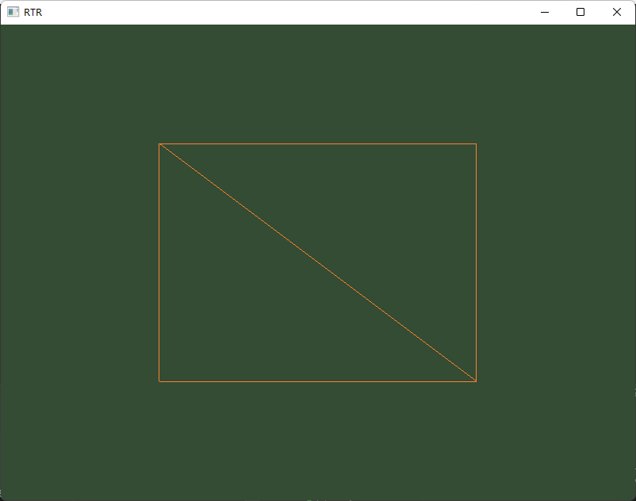
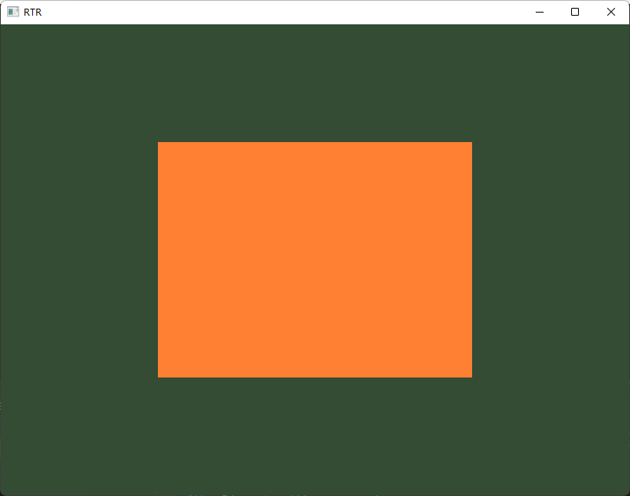
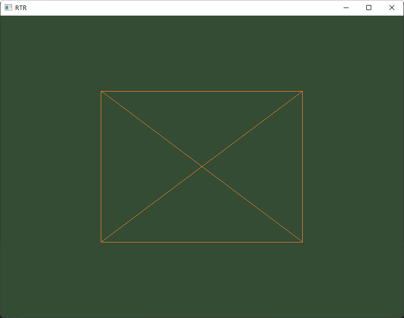
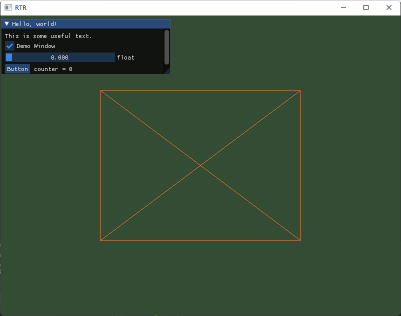

学习中。。。

在window环境下使用openGL学习实时渲染相关的各种基础/算法/实现/技巧等。。。

### ver0.1

搭建基础环境，能够显示出一个窗口。

使用GLFW实现windows下的窗口创建，输入处理等；使用GLAD实现OpenGL相关函数的处理；

参考资料：[你好，窗口 - LearnOpenGL CN (learnopengl-cn.github.io)](https://learnopengl-cn.github.io/01%20Getting%20started/03%20Hello%20Window/)

### ver0.2

以默认模式和线框模式（Wireframe Mode）显示一个立方体

OpenGL可以理解为一个状态机，所以我们的代码主要就是设置状态机的各种设置，使用的顶点数据，使用的shader，然后让他执行渲染即可。

pipeline：

- 创建并绑定VAO，VBO，EBO

- 创建编译顶点着色器，片段着色器，链接

- 主循环中渲染即可

 

现在我们只能看到立方体的一个面，而且是长方形不是正方形，这是因为目前没有对坐标进行各个空间上的变换（局部空间，世界空间，观察空间），这个问题之后再解决。

- 这里存在一个小bug，一个立方体应该渲染2x6x3个顶点（所以左图应有两条对角线），实际代码中只渲染了6个顶点，该bug已在ver0.2.1中修复。

参考资料：[你好，三角形 - LearnOpenGL CN (learnopengl-cn.github.io)](https://learnopengl-cn.github.io/01%20Getting%20started/04%20Hello%20Triangle/)

### ver0.21

整理代码，将着色器程序，顶点数据单独构建成类

Shader：从文件中读取着色器代码，编译并链接。

Mesh：加载顶点数据，生成VAO，VBO，EBO，以及主循环中使用的Draw函数。这里我们把顶点定义为一个结构体，因为顶点除了坐标外还有其他数据，方便之后的更新。

参考资料：[着色器 - LearnOpenGL CN (learnopengl-cn.github.io)](https://learnopengl-cn.github.io/01%20Getting%20started/05%20Shaders/)

### ver0.3

引入[ImGui](https://github.com/ocornut/imgui)，方便后续各种参数的调试，简单说明在[这里](./documents/ImGUI-usage.md)

