学习中。。。

在window环境下使用openGL学习实时渲染相关的各种基础/算法/实现/技巧等。。。

---

Latest：PBR环境光

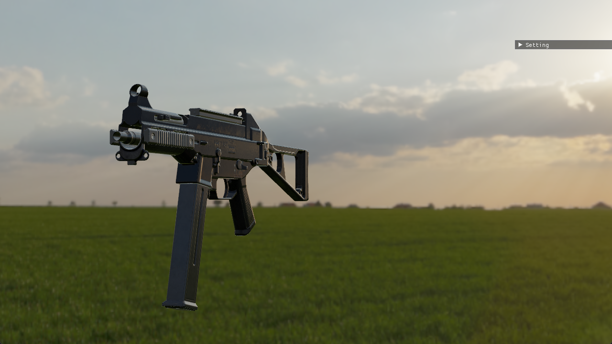

---

一些LearnOpenGL教程里没有的东西&一些自己的理解：

[ImGUI的简单使用](./documents/ImGUI-usage.md)

[关于纹理坐标](./documents/texture.md)

[立方体的法线](./documents/cube-shading.md)

[billboard效果](./documents/billboard.md)

[Nsight Graphics的简单使用](./documents/NsightGraphics-usage.md)

[PBR的一个简单实现 - 直接光照](./documents/PBR-direct-light.md)

[PBR的一个简单实现 - 间接光照](./documents/PBR-IBL.md)

---

### ver0.1

**搭建基础环境，能够显示出一个窗口。**

使用GLFW实现windows下的窗口创建，输入处理等；使用GLAD实现OpenGL相关函数的处理；

参考资料：[你好，窗口 - LearnOpenGL CN (learnopengl-cn.github.io)](https://learnopengl-cn.github.io/01%20Getting%20started/03%20Hello%20Window/)


&nbsp;

### ver0.2

**以默认模式和线框模式（Wireframe Mode）显示一个立方体**

OpenGL可以理解为一个状态机，所以我们的代码主要就是设置状态机的各种设置，使用的顶点数据，使用的shader，然后让他执行渲染即可。

pipeline：

- 创建并绑定VAO，VBO，EBO

- 创建编译顶点着色器，片段着色器，链接

- 主循环中渲染即可

 

现在我们只能看到立方体的一个面，而且是长方形不是正方形，这是因为目前没有对坐标进行各个空间上的变换（局部空间，世界空间，观察空间），这个问题之后再解决。

- 这里存在一个小bug，一个立方体应该渲染2x6x3个顶点（所以左图应有两条对角线），实际代码中只渲染了6个顶点，该bug已在ver0.2.1中修复。

参考资料：[你好，三角形 - LearnOpenGL CN (learnopengl-cn.github.io)](https://learnopengl-cn.github.io/01%20Getting%20started/04%20Hello%20Triangle/)

&nbsp;

### ver0.2.1

**整理代码，将着色器程序，顶点数据单独构建成类**

Shader：从文件中读取着色器代码，编译并链接。

Mesh：加载顶点数据，生成VAO，VBO，EBO，以及主循环中使用的Draw函数。这里我们把顶点定义为一个结构体，因为顶点除了坐标外还有其他数据，方便之后的更新。


参考资料：[着色器 - LearnOpenGL CN (learnopengl-cn.github.io)](https://learnopengl-cn.github.io/01%20Getting%20started/05%20Shaders/)

&nbsp;

### ver0.3

**引入[ImGUI](https://github.com/ocornut/imgui)，方便后续各种参数的调试，简单说明在[这里](./documents/ImGUI-usage.md)**


&nbsp;

### ver0.4

**加入坐标在各个空间上的变换，这样就可以看到立体的mesh了**

这里使用GLM进行各种数学上的计算，然后用ImGUI调整参数（mesh的旋转，缩放，平移），像fps游戏一样的摄像机系统（键鼠控制移动/方向）在后面的版本再实现。

因为现在mesh顶点的坐标会根据各空间的变换矩阵变化，所以在shader中（vertex shader）我们需要将变换矩阵告诉shader，这里主要使用shader中的uniform（变量），所以我们要完善一下Shader类并修改shader的源代码。

（这个版本简单设置了一下包含目录，将不包含.lib和.dll的第三方库（glm，ImGUI）都移至`External/include`中了）（这样可用尖括号include了，这样三方库中的一些include语句就不会报错了）

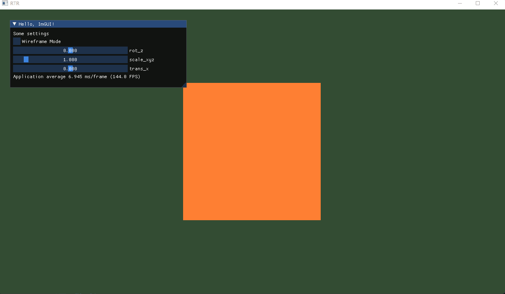

参考资料：

[坐标系统 - LearnOpenGL CN (learnopengl-cn.github.io)](https://learnopengl-cn.github.io/01%20Getting%20started/08%20Coordinate%20Systems/)

[着色器 - LearnOpenGL CN (learnopengl-cn.github.io)](https://learnopengl-cn.github.io/01%20Getting%20started/05%20Shaders/)

&nbsp;

### ver0.5

**把ImGUI的初始化放在另外一个文件中，让main函数看起来干净一点**

将一个结构体传给GUI类让其自动生成相应的能修改结构体内容的ImGUI窗口需要用到**反射**，现在并不会，就先放一下吧，所以现在ImGUI窗口构建的代码仍然写在main.cpp里。

然后加入了输入处理（esc退出）和窗口大小调整的适配。

参考资料：[从零开始手敲次世代游戏引擎（八十四） - 知乎 (zhihu.com)](https://zhuanlan.zhihu.com/p/517828683)

&nbsp;

### ver0.6

**给立方体加上贴图**

首先我们需要用[stb_image.h]([stb/stb_image.h at master · nothings/stb (github.com)](https://github.com/nothings/stb/blob/master/stb_image.h))这个库来加载图片文件（当然其他的库也行），把这个.h文件加入我们的项目即可。

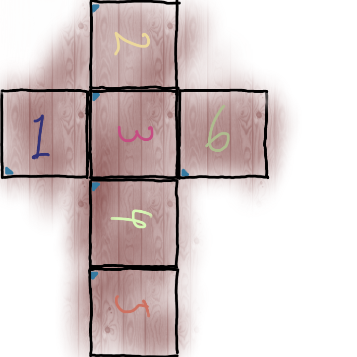

贴图（纹理/texture）一般是和mesh绑定的，所以我们在simpleMesh类中添加相关代码。

我们将一个2D的图片映射到一个3D的mesh上，需要告诉每个顶点对应的贴图上的坐标（这里需要拆分顶点：[一些说明](./documents/texture.md)），所以我们还需要修改顶点属性并告诉OpenGL（用glVertexAttribPointer）如何解析数据。

拆分顶点且坐标设置无误后效果应该是这样的


可以看到有点奇怪，首先我们看到的是cube的里侧，其次有时候后面的面反而把前面的面遮住了。其实这是同一个原因导致的：没有进行[深度测试](https://learnopengl-cn.github.io/01%20Getting%20started/08%20Coordinate%20Systems/#3d)，三角面片会根据渲染顺序显示，而不是远近顺序。使用Z缓冲（Z-buffer）进行深度测试即可

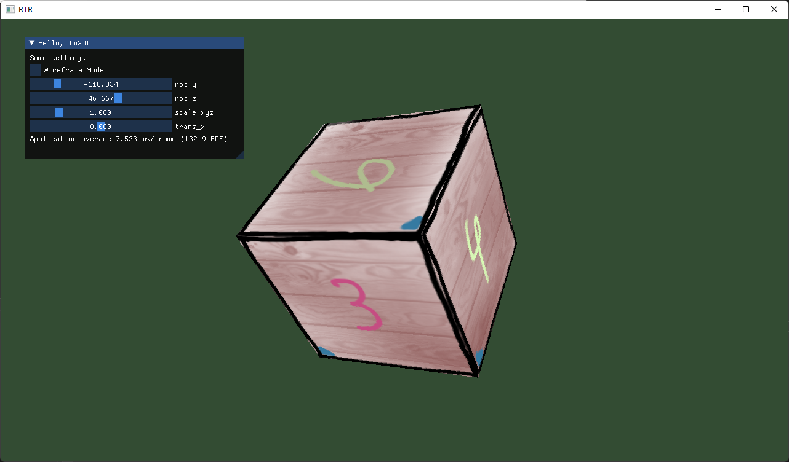

参考资料：[纹理 - LearnOpenGL CN (learnopengl-cn.github.io)](https://learnopengl-cn.github.io/01%20Getting%20started/06%20Textures/)

&nbsp;

### ver0.6.1

**整理代码**

这里我们构建一个Model类，一个model可能由多个mesh组成，所以有一个mesh列表，同时这些mesh可能会重复使用相同的纹理，所以纹理列表也在Model下。

mesh类和之前的simpleMesh类相比，Draw（）需要一个shader类型的参数；使用的纹理变为一个列表，为以后使用多个纹理做准备；并将纹理的载入放在Model类下，其他保持一致。然后部分数据类型换成GLM的数据类型，纹理抽象为Texture结构体，加入texture的类型（目前我们只涉及diffuse这一种贴图，也就是最直观的表示物体颜色的贴图）。

之前的simpleMesh作为Mesh的派生类，作为Model的默认构造的结果。

参考资料：

[模型 - LearnOpenGL CN (learnopengl-cn.github.io)](https://learnopengl-cn.github.io/03%20Model%20Loading/03%20Model/)

[游戏资源中常见的贴图类型 - 知乎 (zhihu.com)](https://zhuanlan.zhihu.com/p/260973533)

&nbsp;

### ver0.7

**创建一个FPS风格摄像机系统**

FPS风格摄像机使用欧拉角即可，暂时不需要四元数。

使用WASD移动摄像机位置，鼠标调整摄像机方向，滚轮调整摄像机视野大小。

场景和渲染的一些参数我们都用GUI去调整，所以对我们Input的处理仅限于调整摄像机，暂时就不单独抽象成一个类了。

为了正常使用FPS摄像机和GUI调整参数，我们用数字键1切换鼠标的作用。（暂时不会控制ImGUI的输入管理，所以键位设置只能避开ImGUI的快捷键）

目前的功能：

WASD：前后左右移动

QE：上下移动（世界空间）

鼠标移动：调整方向

鼠标滚轮：缩放视野大小（FOV）

数字键1：切换鼠标移动的生效状态

参考资料：

[摄像机 - LearnOpenGL CN (learnopengl-cn.github.io)](https://learnopengl-cn.github.io/01%20Getting%20started/09%20Camera/)

关于四元数：

[OpenGL_3_3_Tutorial_Translation/Tutorial 17 Rotations.md at master · cybercser/OpenGL_3_3_Tutorial_Translation (github.com)](https://github.com/cybercser/OpenGL_3_3_Tutorial_Translation/blob/master/Tutorial%2017%20Rotations.md)

[Visualizing quaternions, an explorable video series (eater.net)](https://eater.net/quaternions)

&nbsp;

### ver0.8

**~~加入基础光照：冯氏光照模型（Phong Lighting Model）~~   下个版本再加**

本来想这个版本加入基础光照的，发现调整的东西有点多，就下版本再加了。

- 让SimpleMesh拥有一个DefaultShader成员
  
  首先我们想让SimpleMesh能生成一个单一颜色的立方体，用来表示一个光源（这里只是单纯的视觉上的表示，实际并不发光），渲染这个立方体只需要一个简单的shader，所以我们让SimpleMesh拥有一个DefaultShader成员，如果调用Draw方法时没有提供shader，就让Mesh使用默认的shader。

- 让Mesh和Model的Draw方法接受一个Camera类型的参数（引用传递）
  
  无论是我们提供的shader还是默认的shader，他们都需要设置camera的观察矩阵和投影矩阵，所以我们就干脆让Draw方法接受一个Camera类型的参数，方便坐标转换。

- 让Model和Mesh各拥有一个transform矩阵作为成员变量
  
  这个矩阵表示model在整个世界空间的位置和变换，以及mesh相对model的位置和变换。结合传入的camera，几个变换矩阵都可以在Mesh.Draw()中进行设置了。

- Model中的 vector\<Mesh\> 改为 vector\<Mesh*\>
  
  这是因为我们将Mesh中无shader传入的Draw方法设置成了虚函数（我们希望一般的mesh能够指定shader进行渲染，他们没有默认的shader），并希望SimpleMesh能够调用自己实现的Draw方法。这里涉及到一些动态联编的知识。（参考c++ primer plus 13.4.2）

最后加入了一个单项选择的ImGUI组件，后面对比光照效果会用到。

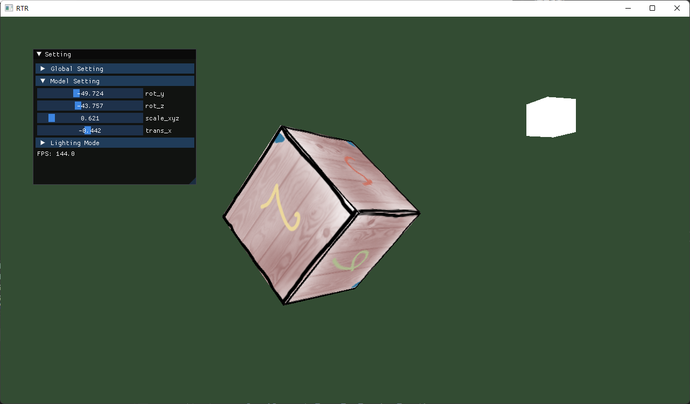

&nbsp;

### ver0.9

**加入基础光照：冯氏光照模型（Phong Lighting Model）**

因为计算光照需要知道片段的法向量，而我们只能将法线属性设置在顶点上而不是面上，而且GL 默认情况下将通过三角面片的三个顶点属性插值计算面片上其他点的属性，所以我们将立方体的八个顶点彻底拆分（得到6x2x3个顶点，拆分的原因和ver0.6中添加纹理时进行拆点的原因是类似的）并分别设置**顶点法线**，从而保证正方体上每个点都具有正确的法线。

当然也有其他不拆点的方法，这里我们把这个问题作为支线[另外讨论](./documents/cube-shading.md)。

然后光照模式的选项用位运算在片段着色器中进行实现，GPU擅长并行计算，但是不擅长if else这种分支选择的操作，所以在着色器中尽量避免if else（不过这个应该也是要分情况的，我也不是很确定，参考[Unity Shader: 优化GPU代码--用step()代替if else等条件语句。_liu_if_else的博客-CSDN博客_shader step](https://blog.csdn.net/liu_if_else/article/details/77455639)）。

最后按照LearnOpenGL的教程完成后就是这样的效果了

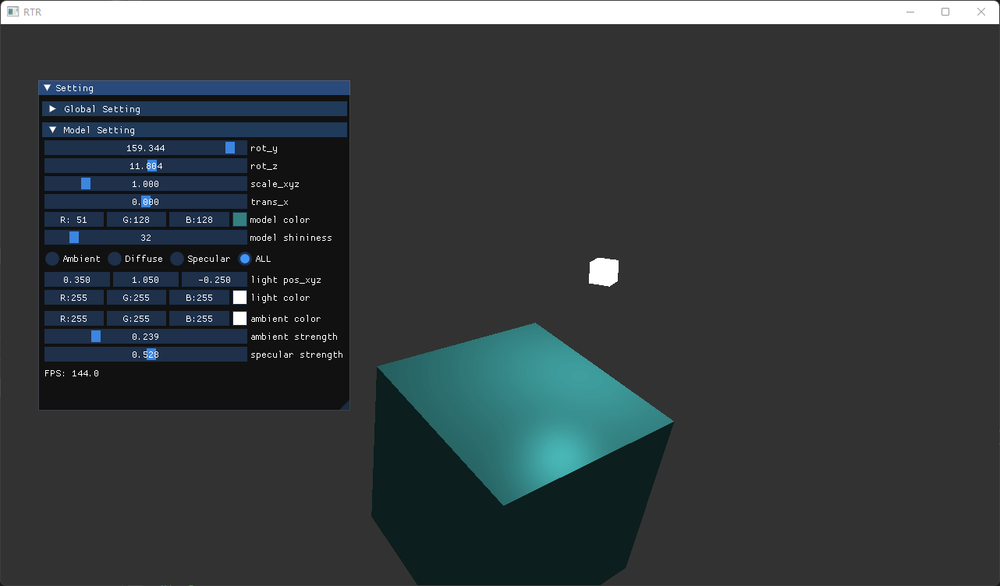

不过现在还有一点奇怪的地方暂时不知道原因，镜面反射亮斑的周围，也就是圈出来的地方会比其他地方（漫反射的亮斑）更暗一些，不知道这个是不是问题，也不知道原因，之后的学习中再留意一下

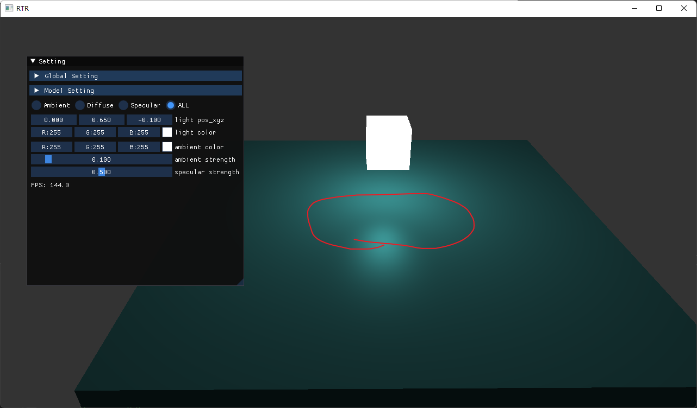

参考资料：

[基础光照 - LearnOpenGL CN (learnopengl-cn.github.io)](https://learnopengl-cn.github.io/02%20Lighting/02%20Basic%20Lighting/#_7)

[枚举、按位与或运算、位移的简单应用 - 连程 - 博客园 (cnblogs.com)](https://www.cnblogs.com/anxin1225/p/4063610.html)


### ver0.9.1

**Gouraud着色（Gouraud Shading）**

Gouraud着色就是Phong着色的顶点着色器实现版本，在顶点上计算光照，然后插值在片面上，因为顶点数量比片段少很多，所以速度很快，但是在顶点数量很少的时候，比如我们的立方体，渲染结果会非常差。

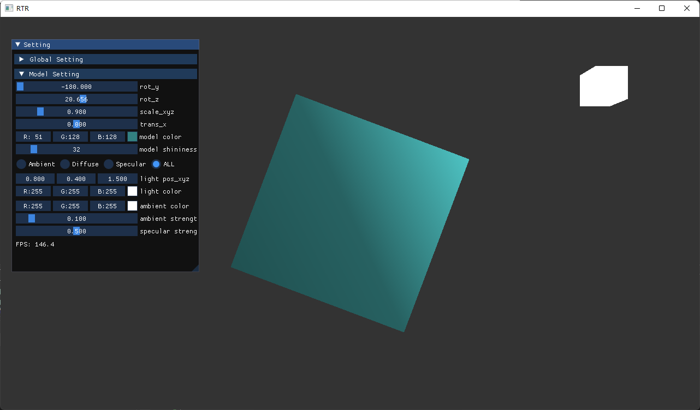


### ver0.9.2

**简单的材质**

在之前的Phong着色和Gouraud着色中，光照由环境光照ambient，漫反射光照diffuse，镜面反射光照specular组成，并且每一种光照都分别由一个强度系数控制，可以说这个系数就是物体的材质信息，决定了这个物体要如何反射/吸收光线，加上反光度（Shininess），我们就得到了一个简单的材质的定义：

```cpp
struct Material {
    vec3 ambient;
    vec3 diffuse;
    vec3 specular;
    float shininess;
}; 
```

当然，光源也有类似的属性（不过现在还不明白光源在物理上是如何能够分别影响漫反射和镜面反射的强度的，这个再之后的学习中再留意，但目前我们的光照模型就这样定义吧）：

```cpp
struct Light {
    vec3 ambient;
    vec3 diffuse;
    vec3 specular;
};
```

最终的光照强度就由材质和光源的强度系数共同控制。

相较于之前的代码，我们只是将相关的参数进行一些整理而已。

参考资料：[材质 - LearnOpenGL CN (learnopengl-cn.github.io)](https://learnopengl-cn.github.io/02%20Lighting/03%20Materials/#_1)


### ver0.9.3

**材质纹理**

上面我们用一个结构体存储了一个mesh的材质，现在我们用一个贴图/纹理来表示这些材质参数，这样就可以在一个mesh上同时展示出不同材质的效果。

除了我们之前已经用到的漫反射贴图，我们还加入了镜面光贴图。

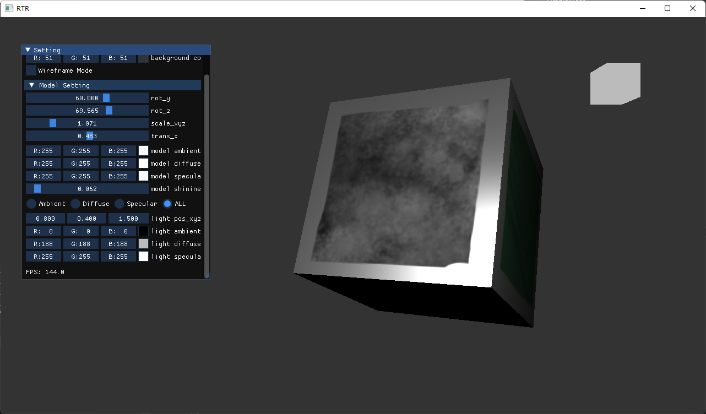

参考资料：[光照贴图 - LearnOpenGL CN (learnopengl-cn.github.io)](https://learnopengl-cn.github.io/02%20Lighting/04%20Lighting%20maps/)


### ver1.0

**光照（Light）**

之前我们使用的是一个简单的点光源，且强度不随距离变化，现在我们优化一下光照强度和距离的关系，然后加入平行光和聚光（Spotlight），并且把光源从simplemesh中独立出来，构成新的类。

关于光照强度的部分我们参考game101课程中 ”能量“ 的概念来计算强度随距离的衰减（blender的光源也是这样设置的）。

点光源我们用一个小圆圈表示，并且这个小圆圈会一直面对摄像机，也就是说无论我们从什么角度观察它，它也不会变成椭圆，这就是billboard（广告牌）效果。这是一个[简单说明](./documents/billboard.md)。

平行光我们用三条平行线段表示，因为我们需要知道平行光的方向，所以这里就不用billboard效果了。

聚光使用三角形加一条线段表示，同样受到位置方向的影响，不使用billboard。

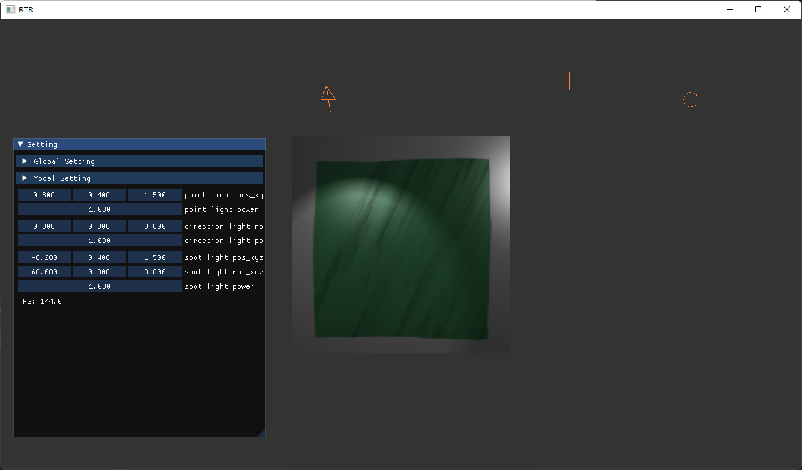

参考资料：

[投光物 - LearnOpenGL CN (learnopengl-cn.github.io)](https://learnopengl-cn.github.io/02%20Lighting/05%20Light%20casters/#_1)

[GAMES101-现代计算机图形学入门-闫令琪_哔哩哔哩_bilibili](https://www.bilibili.com/video/BV1X7411F744?p=7&vd_source=60c102f9b5913c1d3865f271848a154a)

[OpenGl 基本函数 glDrawArrays 详解_frank06504的博客-CSDN博客](https://blog.csdn.net/frank06504/article/details/117523329)


### ver1.1

**Gamma校正**

上面的光照模型中光的能量和距离的平方的倒数成正比，但是实际会发现光照衰减得非常快，这里就涉及到了[Gamma校正](./documents/gamma-correction.md)。

总之就是在光照计算之前把颜色映射到线性空间，最终计算完成后将输出映射回sRGB空间。

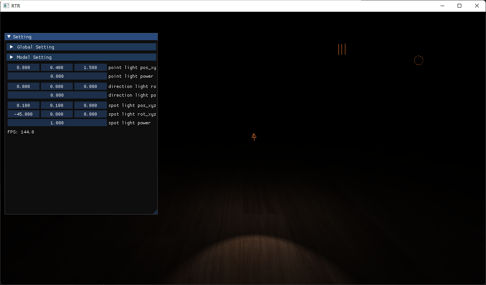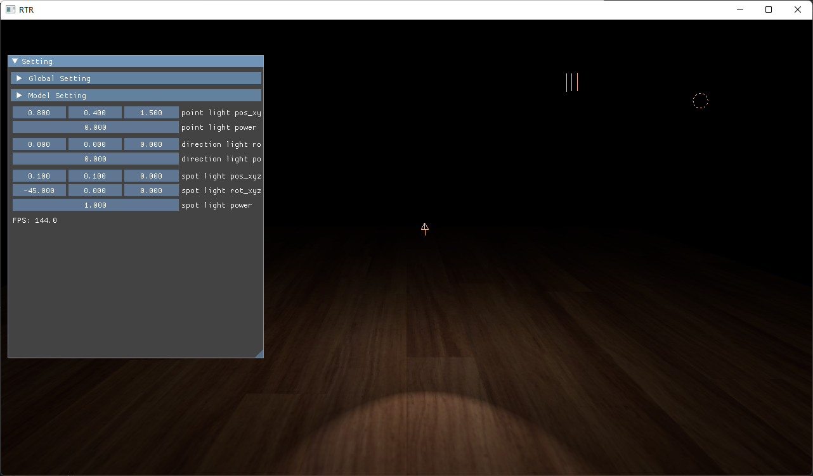

上图无Gamma校正，下图有Gamma校正

可以看到ImGUI也经过了Gamma校正，所以整体偏亮，这个问题之后再解决。

参考资料：

[Gamma校正 - LearnOpenGL CN (learnopengl-cn.github.io)](https://learnopengl-cn.github.io/05%20Advanced%20Lighting/02%20Gamma%20Correction/)

[色彩校正中的 gamma 值是什么？ - 韩世麟的回答 - 知乎](https://www.zhihu.com/question/27467127/answer/37555901)

材质资源：

[Poliigon - Textures, Models and HDRIs for 3D rendering](https://www.poliigon.com/)


### ver1.1.1

**Blinn-Phong Shading**

对Phong Shading中的镜面光进行优化

 

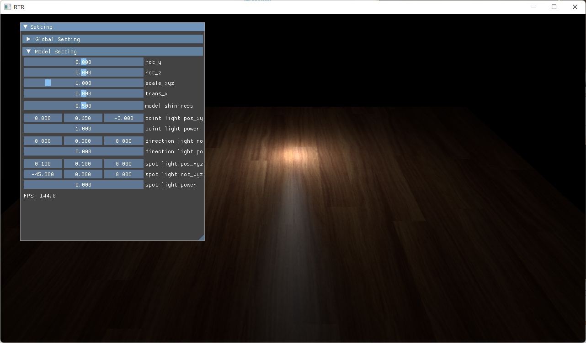 

上图为Phong Shading，下图为Blinn-Phong Shading，这个对比不是很强，没有LearnOpenGL中的例子明显。

这里我们顺便修复一个相机的bug，之前我们的相机有一个Height和Width参数用来表示相机的视野，当时我们直接将窗口大小（800x600）赋值给它们，但这个大小的单位是世界坐标的单位，所以800x600的视野是几乎看不到我们的物体（1x1左右的大小），这会导致相机设置为正射投影时看不到东西（透视投影时Height和Width只用来计算长宽的比例，所以透视投影能正常显示），这里我们修改一下Height和Width的设置，让正射投影的相机也能正常显示。

参考资料：[高级光照 - LearnOpenGL CN (learnopengl-cn.github.io)](https://learnopengl-cn.github.io/05%20Advanced%20Lighting/01%20Advanced%20Lighting/)


### ver1.2

**使用Assimp导入3D资产**

代码基本是直接copy的教程的，主要就是遍历Assimp的数据结构然后转化成我们自己的Model类，没什么好说的。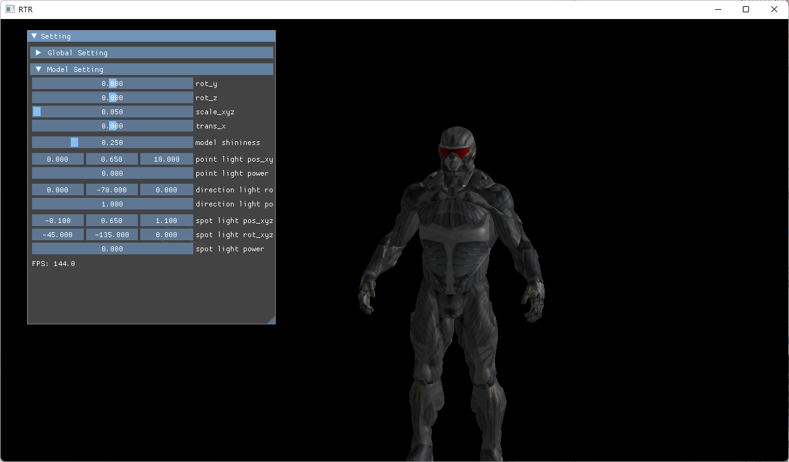

然后这里修复一个之前的bug，在mesh类的setupMesh函数中

```cpp
glBufferData(GL_ARRAY_BUFFER, Vertices.size() * sizeof(Vertices), &Vertices[0], GL_STATIC_DRAW);
glBufferData(GL_ELEMENT_ARRAY_BUFFER, Indices.size() * sizeof(Indices), &Indices[0], GL_STATIC_DRAW);
```

数据的大小` Vertices.size() * sizeof(Vertices)，Indices.size() * sizeof(Indices)`应修改为` Vertices.size() * sizeof(Vertex)，Indices.size() * sizeof(unsigned int)`

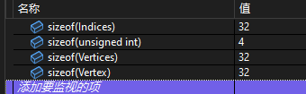

在我们目前的环境中`sizeof(vector)`的大小是32，是`sizeof(unsigned int)`的8倍，所以当`indices.size()`比较大的时候就很容易发生内存冲突，导致gl绑定buffer时出现一些奇怪的问题。绑定顶点信息没有报错的原因如图，只是恰好顶点信息的长度是32和vector一样。

参考资料：

[模型 - LearnOpenGL CN (learnopengl-cn.github.io)](https://learnopengl-cn.github.io/03%20Model%20Loading/03%20Model/#_5)

[C++中sizeof(vector)的问题 - 知乎 (zhihu.com)](https://zhuanlan.zhihu.com/p/257423774)


### ver1.3

**深度缓冲**

类似于Gamma校正（近的位置深度敏感，深度信息存储精度有限），在可视化深度之前要把深度缓冲中的值映射到线性空间。

> 重要的是要记住深度缓冲中的值在屏幕空间中不是线性的（在透视矩阵应用之前在观察空间中是线性的）

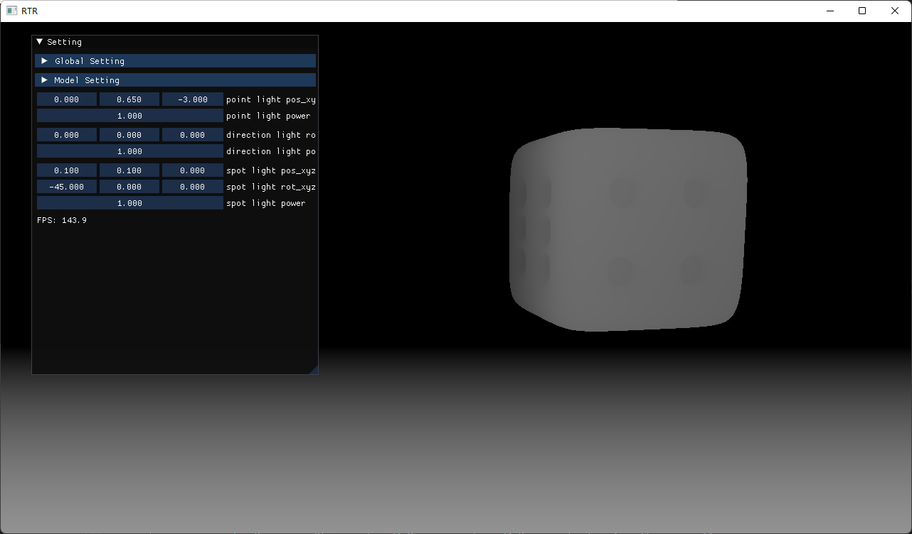

（为了效果比较明显，这张图的相机的Far平面设置成了5.0，Near平面为0.1）

参考资料：[深度测试 - LearnOpenGL CN (learnopengl-cn.github.io)](https://learnopengl-cn.github.io/04%20Advanced%20OpenGL/01%20Depth%20testing/#_1)

模型资源：[DICE - Download Free 3D model by SHARK FIN (@mo7amed85)](https://sketchfab.com/3d-models/free-hq-pbr-game-model-metallic-sapphire-dice-f4e12f278ea74f648eeaaaec245a4a44)


### ver1.4

**模板测试 - 模型描边**

这里将描边的方式简单修改一下：将模型的顶点沿法线方向移动一段距离。（单纯的缩放再复杂物体上的表现会比较差）

部分片面（因为纹理和法线而拆点的地方）沿法线移动后就会分离，这时候如果相机离得比较近而且描边宽度较大就会看到缺陷。

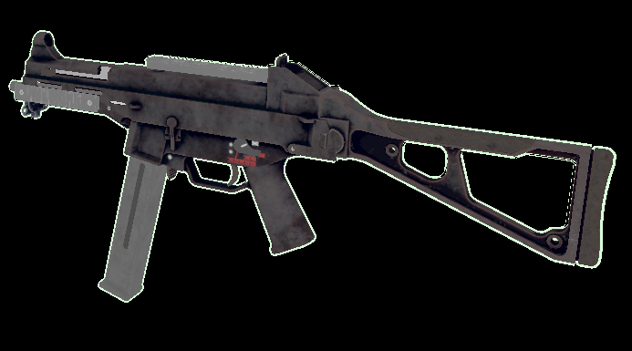

参考资料：

[模板测试 - LearnOpenGL CN (learnopengl-cn.github.io)](https://learnopengl-cn.github.io/04%20Advanced%20OpenGL/02%20Stencil%20testing/)

[glStencilFunc function (Gl.h) - Win32 apps | Microsoft Docs](https://docs.microsoft.com/en-us/windows/win32/opengl/glstencilfunc?redirectedfrom=MSDN)

[glStencilOp function (Gl.h) - Win32 apps | Microsoft Docs](https://docs.microsoft.com/en-us/windows/win32/opengl/glstencilop?redirectedfrom=MSDN)

模型资源：

[HK UMP - Lowpoly - Download Free 3D model by Enzo Amanrich (@ImaGeniusMan)](https://sketchfab.com/3d-models/hk-ump-lowpoly-77edc85265d4486d928fcb21c5175b10)


### ver1.5

**帧缓冲**

面剔除：`glEnable(GL_CULL_FACE);`

这里我们依次渲染了原始图像，渲染了平面四边形，渲染了GUI，需要注意Gamma校正（sRGB的开启和关闭）。

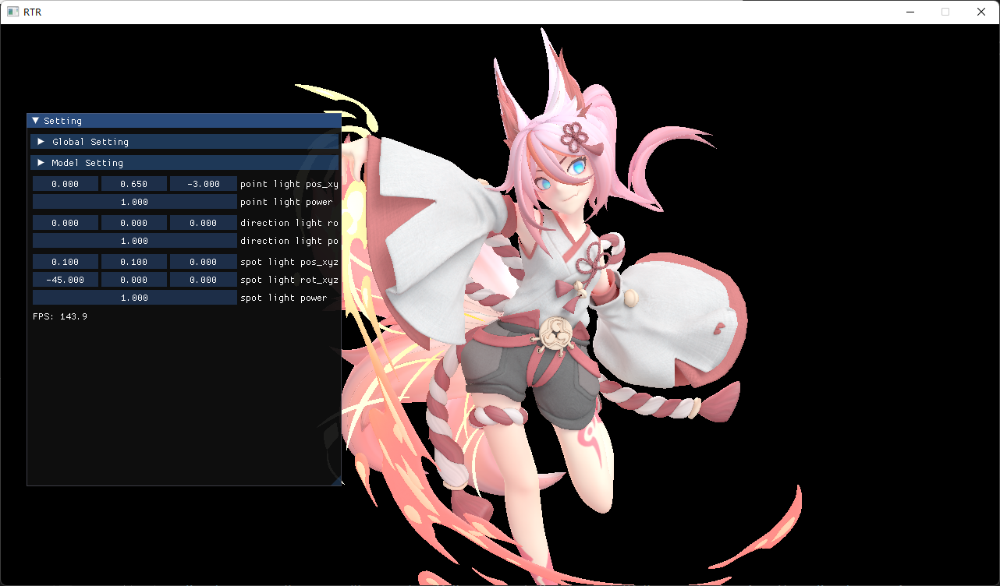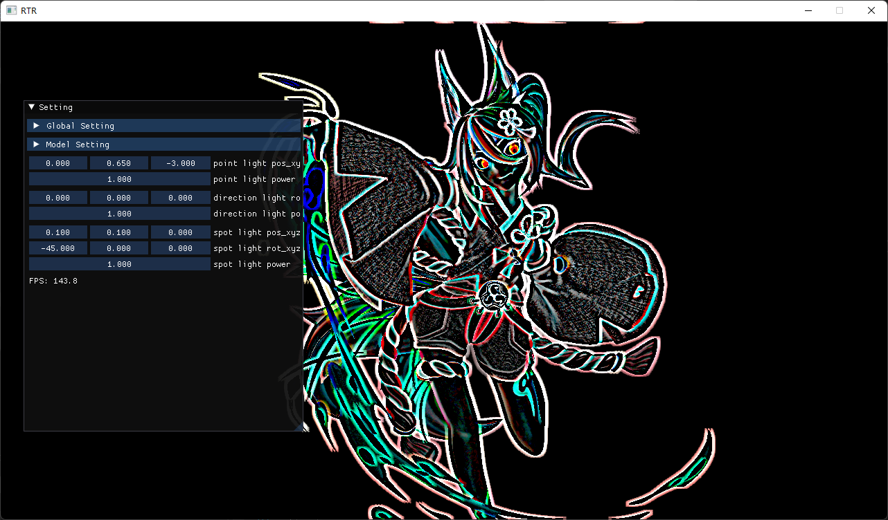

上：正常；下：边缘检测

参考资料：[帧缓冲 - LearnOpenGL CN (learnopengl-cn.github.io)](https://learnopengl-cn.github.io/04%20Advanced%20OpenGL/05%20Framebuffers/#_9)

模型资源：[Higokumaru | Honkai Impact 3rd - Download Free 3D model by MooKorea ](https://sketchfab.com/3d-models/higokumaru-honkai-impact-3rd-0e903387170846f5939adaa0c277b91b)


### ver1.6

**法线贴图**

切线/副切线由Assimp计算完成。

注意：

> 法线贴图的切线和副切线与纹理坐标的两个方向对齐

所以一个三角形切线空间的三个基：法线，切线，副切线的方向是确定的。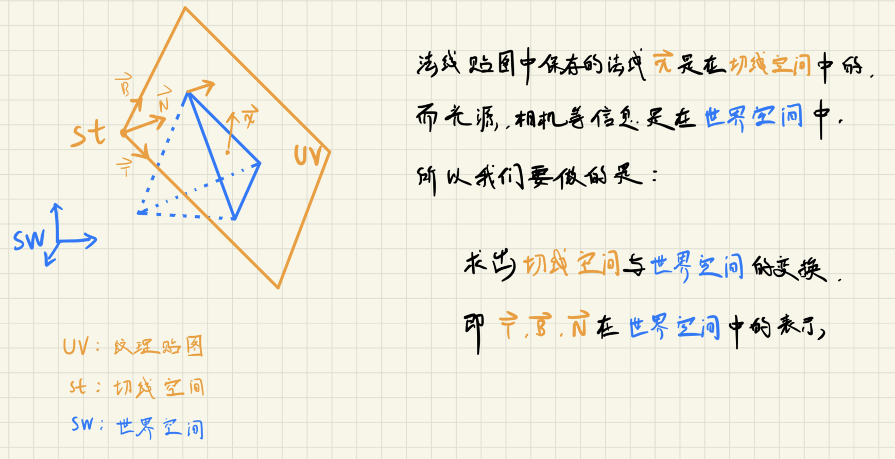

Shader程序中只能读取不能修改uniform变量，所以我们在顶点着色器中变换光源的世界坐标（和平行光、聚光的方向）单独传递给片段着色器，所以代码看起来有点乱。

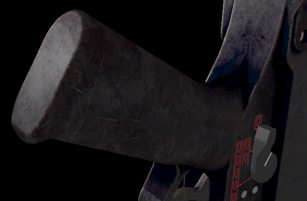 

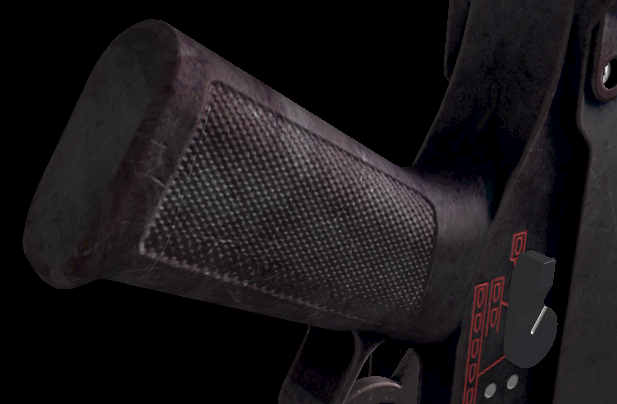 

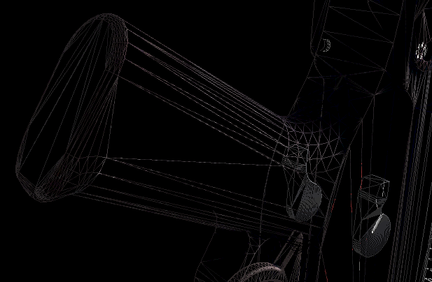 


上：只有环境光；中：平行光；下：线框模式。

参考资料：[法线贴图 - LearnOpenGL CN (learnopengl-cn.github.io)](https://learnopengl-cn.github.io/05%20Advanced%20Lighting/04%20Normal%20Mapping/)

模型资源：[HK UMP - Lowpoly - Download Free 3D model by Enzo Amanrich (@ImaGeniusMan)](https://sketchfab.com/3d-models/hk-ump-lowpoly-77edc85265d4486d928fcb21c5175b10)


### ver1.7

**抗锯齿/反走样 Anti-aliasing**

离屏MSAA：

在之前的离屏渲染的基础上再加上一个（多采样）缓冲帧，如果不使用MSAA，这个缓冲帧无作用；如果使用MSAA，那么先将场景渲染到这个（多采样）缓冲帧中，然后用`glBlitFramebuffer`将这个（多采样）缓冲帧还原/Resolve到原来的屏幕缓冲帧中，剩下的保持一致。

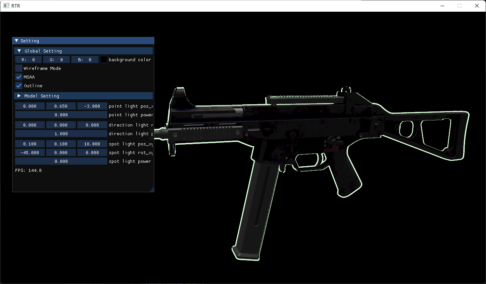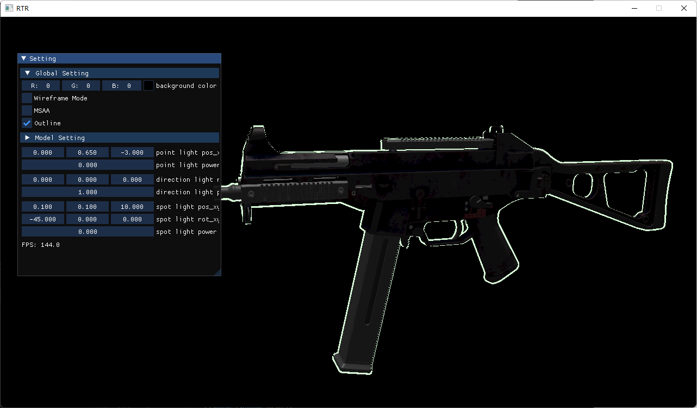

上：MSAA on； 下：MSAA off

我们之前的描边宽度非常小，所以锯齿非常严重，开启MSAA后会缓解很多。

参考资料：[抗锯齿 - LearnOpenGL CN (learnopengl-cn.github.io)](https://learnopengl-cn.github.io/04%20Advanced%20OpenGL/11%20Anti%20Aliasing/#openglmsaa)

模型资源：[HK UMP - Lowpoly - Download Free 3D model by Enzo Amanrich (@ImaGeniusMan)](https://sketchfab.com/3d-models/hk-ump-lowpoly-77edc85265d4486d928fcb21c5175b10)


### ver1.8

**立方体贴图 - 天空盒**

新建一个skybox类，剩下的照抄教程即可。

环境映射（Environment Mapping）之后再实现。

（地板缺少了切线信息和法线贴图，所以看起来比较奇怪）

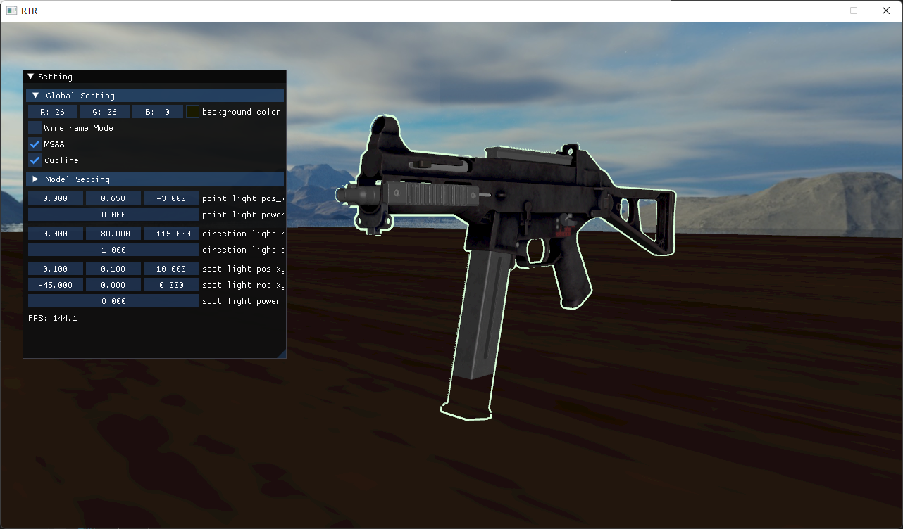

这是目前我自己尝试出的包含描边和天空盒的正确的渲染顺序，模板缓冲还是不是很熟悉，之后慢慢理解。

```cpp
// meshes that may draw outline
 {
glStencilOp(GL_KEEP, GL_KEEP, GL_REPLACE);
glStencilFunc(GL_ALWAYS, 1, 0xFF);
glStencilMask(0xFF);

main_model.Draw(phong_shader, mainCamera);

glStencilMask(0x00);
}

// meshes that never draw outline
{
floor.Draw(phong_shader, mainCamera);
}

//skybox
glDepthFunc(GL_LEQUAL);
skybox.Draw(mainCamera);
glDepthFunc(GL_LESS);

if(draw_outline){
    // draw outline
    glStencilFunc(GL_NOTEQUAL, 1, 0xFF);
    glStencilMask(0x00);
    glDisable(GL_DEPTH_TEST);

    main_model.Draw(outline_shader, mainCamera);

    glStencilFunc(GL_ALWAYS, 1, 0xFF);
    glStencilMask(0xFF); // this will affect glClear
    glEnable(GL_DEPTH_TEST);
}
```

参考资料：[立方体贴图 - LearnOpenGL CN (learnopengl-cn.github.io)](https://learnopengl-cn.github.io/04%20Advanced%20OpenGL/06%20Cubemaps/#_11)

模型资源：[HK UMP - Lowpoly - Download Free 3D model by Enzo Amanrich (@ImaGeniusMan)](https://sketchfab.com/3d-models/hk-ump-lowpoly-77edc85265d4486d928fcb21c5175b10)


### ver1.8.1

**立方体贴图 - 环境映射**

需要把反射/折射光投影到世界空间中，所以法线空间的变换在片段着色器中完成（之前是在顶点着色器中进行逆变换）

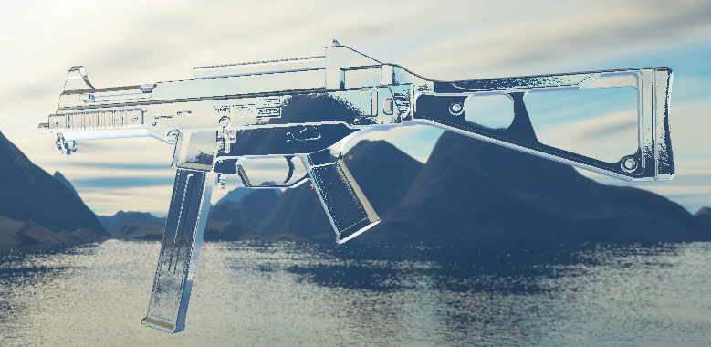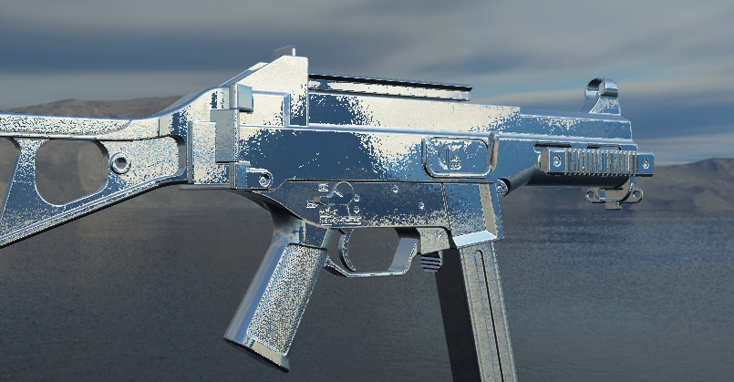

上：单面折射（Single-side Refraction）

下：反射

参考资料：[立方体贴图 - LearnOpenGL CN (learnopengl-cn.github.io)](https://learnopengl-cn.github.io/04%20Advanced%20OpenGL/06%20Cubemaps/#_11)

模型资源：[HK UMP - Lowpoly - Download Free 3D model by Enzo Amanrich (@ImaGeniusMan)](https://sketchfab.com/3d-models/hk-ump-lowpoly-77edc85265d4486d928fcb21c5175b10)


### ver1.9

**HDR**

修改一下颜色缓冲（屏幕纹理和MSAA的纹理）的格式，然后渲染屏幕矩形的时候进行色调映射（Tone Mapping）即可。

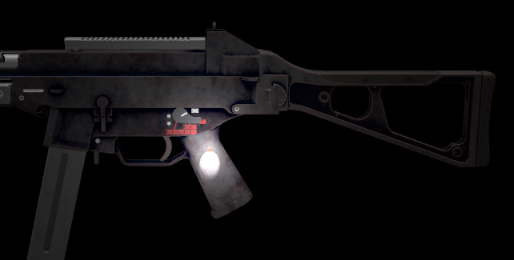 

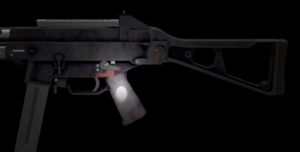 

上：HDR off；    下：HDR on

参考资料：[HDR - LearnOpenGL CN (learnopengl-cn.github.io)](https://learnopengl-cn.github.io/05%20Advanced%20Lighting/06%20HDR/)


### ver1.9.1

**泛光（Bloom）**

补充一下之前关于多个纹理的绑定问题：

1. 激活**纹理单元**；`glActiveTexture(GL_TEXTURE0 + i);`

2. 绑定**纹理**到**纹理单元**；`glBindTexture(GL_TEXTURE_2D, screenTexture);`

3. 绑定**纹理单元**到**采样器名称**；`shader.setInt("sampler2D_name", 0 + i);`

   

在使用MSAA的基础上使用泛光时，ms的帧缓冲和屏幕缓冲都有两个颜色附件（color attachment），上面使用了`glDrawBuffers(2, attachments);`会让readbuffer读取到的颜色附件同时被写到drawbuffer的**所有**颜色附件中，所以我们指定颜色附件的读写：

```cpp
// msaa
if (use_MSAA) {
    // MS buffer to screen buffer
    glBindFramebuffer(GL_READ_FRAMEBUFFER, msBuffer);
    glBindFramebuffer(GL_DRAW_FRAMEBUFFER, screenBuffer);

    glReadBuffer(attachments[0]);
    glDrawBuffer(attachments[0]);
    glBlitFramebuffer(0, 0, SCR_WIDTH, SCR_HEIGHT, 0, 0, SCR_WIDTH, SCR_HEIGHT, GL_COLOR_BUFFER_BIT, GL_NEAREST);

    glReadBuffer(attachments[1]);
    glDrawBuffer(attachments[1]);
    glBlitFramebuffer(0, 0, SCR_WIDTH, SCR_HEIGHT, 0, 0, SCR_WIDTH, SCR_HEIGHT, GL_COLOR_BUFFER_BIT, GL_NEAREST);

    glDrawBuffers(2, attachments);
}
```

注意最后要再次调用`glDrawBuffers(2, attachments);`保证之后的帧正常渲染（因为之前的这个语句写在渲染循环之外），或者将这个语句放在渲染循环内。

然后高斯模糊的实现我们稍微修改一下，直接将ReadBuffer和DrawBuffer分开指定，交替渲染，依次垂直/水平模糊。

``` cpp
for (GLuint i = 0; i < iter; i++) {

    glBindFramebuffer(GL_READ_FRAMEBUFFER, pingpongFBO[0]);
    glBindFramebuffer(GL_DRAW_FRAMEBUFFER, pingpongFBO[1]);

    glActiveTexture(0);
    glBindTexture(GL_TEXTURE_2D, first_iteration ? screenBloomTexture : pingpongBuffer[0]);
    shaderBlur.setBool("horizontal", true);
    rect.Draw(shaderBlur);

    glBindFramebuffer(GL_READ_FRAMEBUFFER, pingpongFBO[1]);
    glBindFramebuffer(GL_DRAW_FRAMEBUFFER, pingpongFBO[0]);

    glActiveTexture(0);
    glBindTexture(GL_TEXTURE_2D, pingpongBuffer[1]);
    shaderBlur.setBool("horizontal", false);
    rect.Draw(shaderBlur);

    if (first_iteration)
        first_iteration = false;

}
```

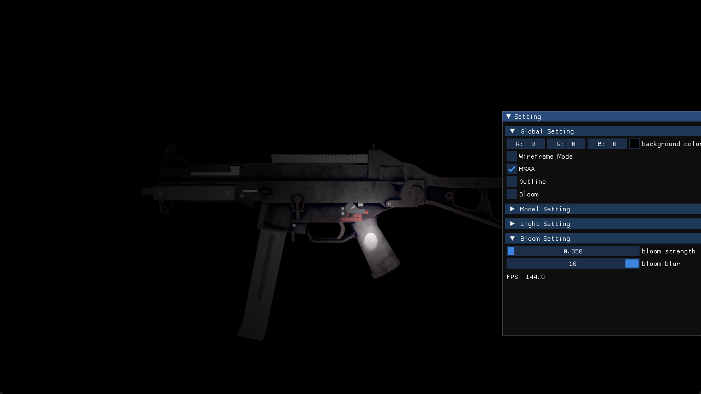 

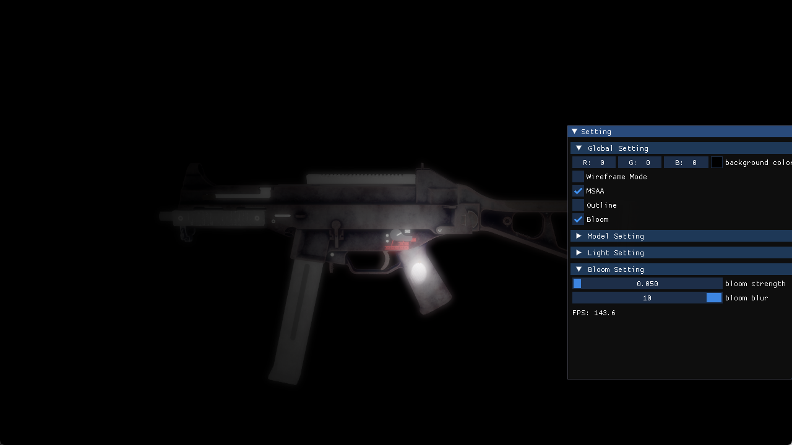 

上：Bloom off；下：Bloom on

参考资料：

[泛光 - LearnOpenGL CN (learnopengl-cn.github.io)](https://learnopengl-cn.github.io/05%20Advanced%20Lighting/07%20Bloom/)

https://blog.csdn.net/What_can_you_do/article/details/125605463

[opengl - Does glBlitFramebuffer copy all color attachments if GL_COLOR_BUFFER_BIT mask is specified? - Stack Overflow](https://stackoverflow.com/questions/17691702/does-glblitframebuffer-copy-all-color-attachments-if-gl-color-buffer-bit-mask-is)


### ver1.9.2

**生成球体网格（Sphere Mesh）**

打算下一部分开始PBR的部分，在这之前我们先小小造个轮子，实现球体网格的生成，方便看着色器效果。

这里先实现UV Sphere，比较直观。

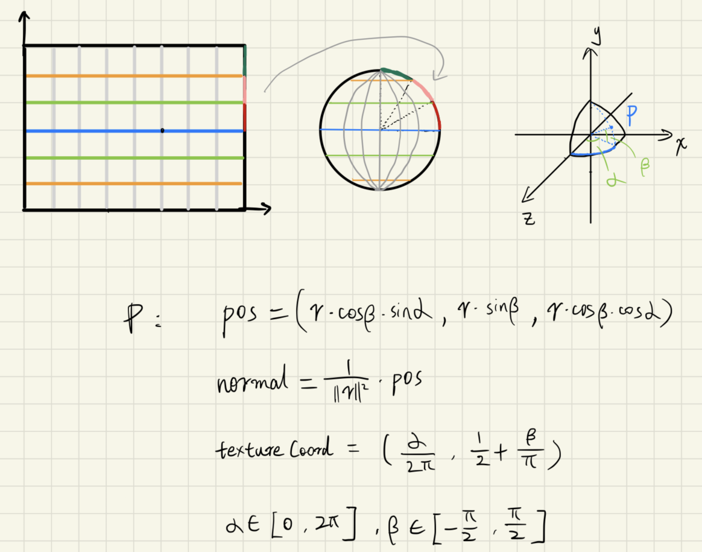 

注意缝合线的位置是需要拆点的，所以极点和竖直的缝合线上的点都需要有，所以alpha和beta的左右都是闭区间。

切线和副切线的计算参考LearnOpenGL的法线贴图这一节，顺便把之前的立方体，矩形的mesh的切线也补上了。

[LearnOpenGL - Lighting](https://learnopengl.com/PBR/Lighting) 这一节的源码使用了GL_TRIANGLE_STRIP进行绘制，我们还是按照之前的GL_TRIANGLE绘制，所以生成index的代码不能直接照抄，还是自己写一下吧（注意要逆时针顺序保证三角形面法线朝外）。

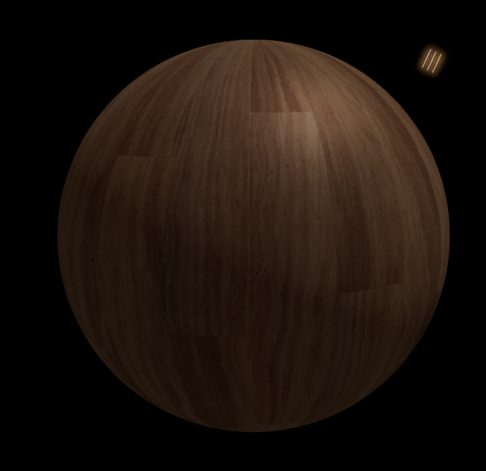 


参考资料：

[LearnOpenGL - Lighting](https://learnopengl.com/PBR/Lighting) 这一节的源码

[法线贴图 - LearnOpenGL CN (learnopengl-cn.github.io)](https://learnopengl-cn.github.io/05 Advanced Lighting/04 Normal Mapping/#_3)

[UV Sphere (catlikecoding.com)](https://catlikecoding.com/unity/tutorials/procedural-meshes/uv-sphere/)

[catch 22 - Andreas Kahler's blog: Creating an icosphere mesh in code](http://blog.andreaskahler.com/2009/06/creating-icosphere-mesh-in-code.html)

[理解GL_TRIANGLE_STRIP等绘制三角形序列的三种方式-CSDN博客](https://blog.csdn.net/xiajun07061225/article/details/7455283)


### ver2.0

**PBR - 直接光照**

首先修正一下之前的一个bug，在使用正交相机时，视线方向应该是相机方向而不是用相机位置减去片段位置。

PBR相关的教程比较多了，但是还是自己稍微写了一下这样理解得清楚一些：[PBR的一个简单实现 - 直接光照](./documents/PBR-direct-light.md)

这张图中只有一个平行光。

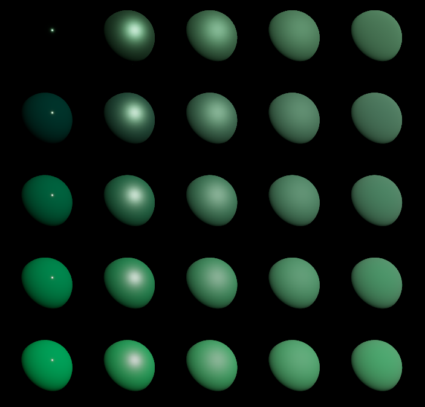 

左：粗糙度为0；下：金属度为0；右：粗糙度为1；上：金属度为1；


参考资料：

[理论 - LearnOpenGL CN (learnopengl-cn.github.io)](https://learnopengl-cn.github.io/07 PBR/01 Theory/)

[如何在Unity中造一个PBR Shader轮子 - 知乎 (zhihu.com)](https://zhuanlan.zhihu.com/p/68025039)


### ver2.1

**PBR - 间接光照（环境光）**

目前正交相机不能正确显示skybox，所以我们还是回到透视相机（记得修改着色器中的视线方向）。

同样的一点说明：[PBR的一个简单实现 - 间接光照](./documents/PBR-IBL.md)

PS：cmftStudio导出预滤波环境贴图（pre-filtered environment map）时只能导出LOD=0（也就是粗糙度为0的贴图），现在为了快速得到一个结果我们直接使用openGL的glGenerateMipmap生成其他LOD的贴图，这个效果在粗糙度较高时是**非常非常差**的。原因很简单，我们将Equirectangular Map转化为Cube Map时是分别渲染6个方向的结果，直接使用glGenerateMipmap只会分别在6个方向进行下采样，而正确的预滤波环境贴图会从全部的方向上采样，不会出现这样的边界。后续我们再研究如何得到正确的预滤波环境贴图（可能还是需要手动写代码完成这些贴图的预计算）。

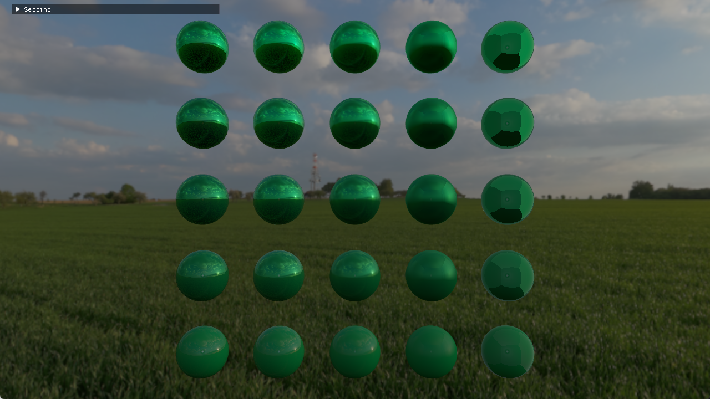

左：粗糙度为0；下：金属度为0；右：粗糙度为1；上：金属度为1；


参考资料：

[漫反射辐照 - LearnOpenGL CN (learnopengl-cn.github.io)](https://learnopengl-cn.github.io/07 PBR/03 IBL/01 Diffuse irradiance/#_1)

[镜面IBL - LearnOpenGL CN (learnopengl-cn.github.io)](https://learnopengl-cn.github.io/07 PBR/03 IBL/02 Specular IBL/)

[深入理解 PBR/基于图像照明 (IBL) - 知乎 (zhihu.com)](https://zhuanlan.zhihu.com/p/66518450)

HDR素材：

[NoEmotion HDRs](http://noemotionhdrs.net/hdrevening.html)


### ver2.2

**PBR - 整理代码**

上一节中的图还有一点小bug，每个球中心会有一个奇怪的圆圈，这是因为使用的BRDF LUT的图片有点问题，所以我们还是自己积分生成一下，再加上辐照度图（irradiance map），预滤波环境贴图（pre-filtered environment map），我们需要写3个着色器来生成这些贴图，因为涉及到积分公式的推导、通过采样进行积分求解、和随机采样序列的生成，这些我也还没完全弄懂，所以着色器代码直接复制粘贴[LearnOpenGL](https://learnopengl.com/code_viewer_gh.php?code=src/6.pbr/2.2.1.ibl_specular/ibl_specular.cpp)的，暂时也不进行讲解。

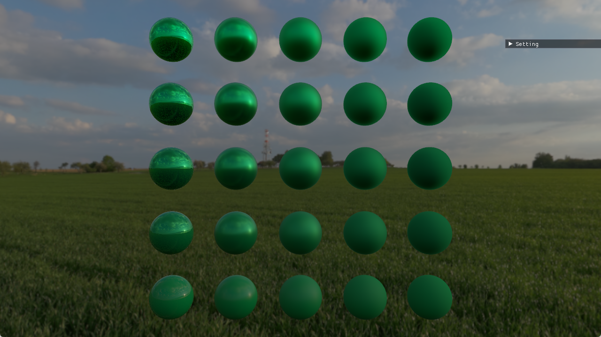

然后我们加入各种贴图，还有点光源和聚光的PBR。gltf的模型中金属度和粗糙度存放在同一张贴图中，G通道为粗糙度，B通道为金属度。


效果还不错，但是移动摄像机的时候高光部分会闪烁，特别是在高光较多的场景中：

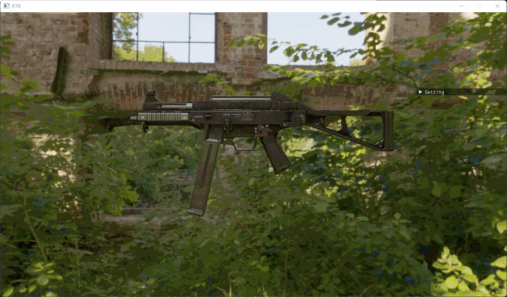

这个可能是着色走样和时间走样导致的，之后再研究相关的解决方案。


参考资料：

[Code Viewer. Source code: src/6.pbr/2.2.1.ibl_specular/ibl_specular.cpp (learnopengl.com)](https://learnopengl.com/code_viewer_gh.php?code=src/6.pbr/2.2.1.ibl_specular/ibl_specular.cpp)

[gltf 2.0快速入门_万里归来少年心的博客-CSDN博客_gltf](https://blog.csdn.net/liyazhen2011/article/details/122251538)

[漫反射辐照 - LearnOpenGL CN (learnopengl-cn.github.io)](https://learnopengl-cn.github.io/07 PBR/03 IBL/01 Diffuse irradiance/#_1)

[镜面IBL - LearnOpenGL CN (learnopengl-cn.github.io)](https://learnopengl-cn.github.io/07 PBR/03 IBL/02 Specular IBL/)

[深入理解 PBR/基于图像照明 (IBL) - 知乎 (zhihu.com)](https://zhuanlan.zhihu.com/p/66518450)

[深入剖析MSAA - 知乎 (zhihu.com)](https://zhuanlan.zhihu.com/p/32823370)

HDR素材：

[NoEmotion HDRs](http://noemotionhdrs.net/hdrevening.html)

http://www.hdrlabs.com/sibl/archive.html


### ver2.3

**整理代码**

下一节打算实现**延迟渲染(Deferred Rendering)**，将会和目前的渲染有一些区别，而且现在main函数有点乱了，所以这一节还是整理一下代码。创建一个ForwardRender类，保存渲染需要的各种frame buffer和texture，以及整个渲染pipeline。创建一个Scene类，保存一个场景需要的模型，天空盒，相机，Shaders，以及相应的Set，Draw函数。但是用户输入这一块（相机移动旋转，ImGUI调整参数）还是比较乱，之后再说吧。

