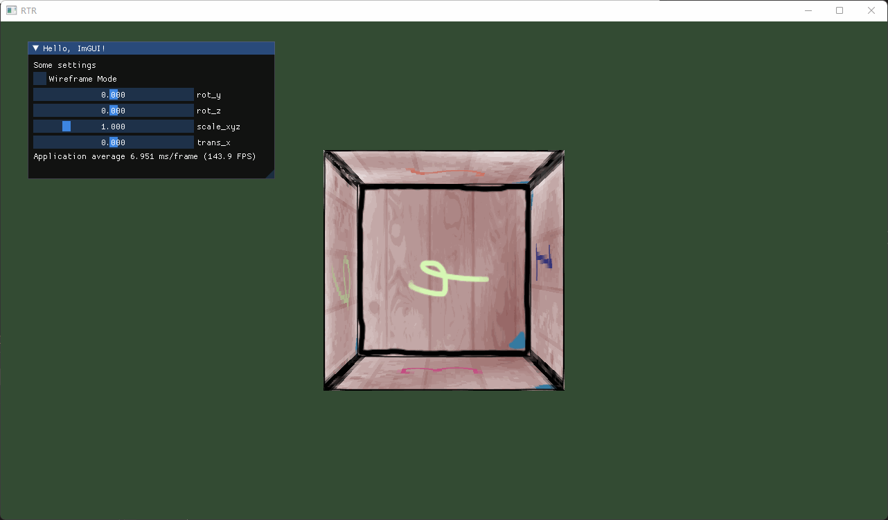

学习中。。。

在window环境下使用openGL学习实时渲染相关的各种基础/算法/实现/技巧等。。。

&nbsp;

一些LearnOpenGL教程里没有的东西&一些自己的理解：

[ImGUI的简单使用](./documents/ImGUI-usage.md)

[关于纹理坐标](./documents/texture.md)

[立方体的法线](./documents/cube-shading.md)

[billboard效果](./documents/billboard.md)

### ver0.1

**搭建基础环境，能够显示出一个窗口。**

使用GLFW实现windows下的窗口创建，输入处理等；使用GLAD实现OpenGL相关函数的处理；

参考资料：[你好，窗口 - LearnOpenGL CN (learnopengl-cn.github.io)](https://learnopengl-cn.github.io/01%20Getting%20started/03%20Hello%20Window/)


&nbsp;

### ver0.2

**以默认模式和线框模式（Wireframe Mode）显示一个立方体**

OpenGL可以理解为一个状态机，所以我们的代码主要就是设置状态机的各种设置，使用的顶点数据，使用的shader，然后让他执行渲染即可。

pipeline：

- 创建并绑定VAO，VBO，EBO

- 创建编译顶点着色器，片段着色器，链接

- 主循环中渲染即可

 

现在我们只能看到立方体的一个面，而且是长方形不是正方形，这是因为目前没有对坐标进行各个空间上的变换（局部空间，世界空间，观察空间），这个问题之后再解决。

- 这里存在一个小bug，一个立方体应该渲染2x6x3个顶点（所以左图应有两条对角线），实际代码中只渲染了6个顶点，该bug已在ver0.2.1中修复。

参考资料：[你好，三角形 - LearnOpenGL CN (learnopengl-cn.github.io)](https://learnopengl-cn.github.io/01%20Getting%20started/04%20Hello%20Triangle/)

&nbsp;

### ver0.2.1

**整理代码，将着色器程序，顶点数据单独构建成类**

Shader：从文件中读取着色器代码，编译并链接。

Mesh：加载顶点数据，生成VAO，VBO，EBO，以及主循环中使用的Draw函数。这里我们把顶点定义为一个结构体，因为顶点除了坐标外还有其他数据，方便之后的更新。


参考资料：[着色器 - LearnOpenGL CN (learnopengl-cn.github.io)](https://learnopengl-cn.github.io/01%20Getting%20started/05%20Shaders/)

&nbsp;

### ver0.3

**引入[ImGUI](https://github.com/ocornut/imgui)，方便后续各种参数的调试，简单说明在[这里](./documents/ImGUI-usage.md)**


&nbsp;

### ver0.4

**加入坐标在各个空间上的变换，这样就可以看到立体的mesh了**

这里使用GLM进行各种数学上的计算，然后用ImGUI调整参数（mesh的旋转，缩放，平移），像fps游戏一样的摄像机系统（键鼠控制移动/方向）在后面的版本再实现。

因为现在mesh顶点的坐标会根据各空间的变换矩阵变化，所以在shader中（vertex shader）我们需要将变换矩阵告诉shader，这里主要使用shader中的uniform（变量），所以我们要完善一下Shader类并修改shader的源代码。

（这个版本简单设置了一下包含目录，将不包含.lib和.dll的第三方库（glm，ImGUI）都移至`External/include`中了）（这样可用尖括号include了，这样三方库中的一些include语句就不会报错了）


参考资料：

[坐标系统 - LearnOpenGL CN (learnopengl-cn.github.io)](https://learnopengl-cn.github.io/01%20Getting%20started/08%20Coordinate%20Systems/)

[着色器 - LearnOpenGL CN (learnopengl-cn.github.io)](https://learnopengl-cn.github.io/01%20Getting%20started/05%20Shaders/)

&nbsp;

### ver0.5

**把ImGUI的初始化放在另外一个文件中，让main函数看起来干净一点**

将一个结构体传给GUI类让其自动生成相应的能修改结构体内容的ImGUI窗口需要用到**反射**，现在并不会，就先放一下吧，所以现在ImGUI窗口构建的代码仍然写在main.cpp里。

然后加入了输入处理（esc退出）和窗口大小调整的适配。

参考资料：[从零开始手敲次世代游戏引擎（八十四） - 知乎 (zhihu.com)](https://zhuanlan.zhihu.com/p/517828683)

&nbsp;

### ver0.6

**给立方体加上贴图**

首先我们需要用[stb_image.h]([stb/stb_image.h at master · nothings/stb (github.com)](https://github.com/nothings/stb/blob/master/stb_image.h))这个库来加载图片文件（当然其他的库也行），把这个.h文件加入我们的项目即可。


贴图（纹理/texture）一般是和mesh绑定的，所以我们在simpleMesh类中添加相关代码。

我们将一个2D的图片映射到一个3D的mesh上，需要告诉每个顶点对应的贴图上的坐标（这里需要拆分顶点：[一些说明](./documents/texture.md)），所以我们还需要修改顶点属性并告诉OpenGL（用glVertexAttribPointer）如何解析数据。

拆分顶点且坐标设置无误后效果应该是这样的



可以看到有点奇怪，首先我们看到的是cube的里侧，其次有时候后面的面反而把前面的面遮住了。其实这是同一个原因导致的：没有进行[深度测试](https://learnopengl-cn.github.io/01%20Getting%20started/08%20Coordinate%20Systems/#3d)，三角面片会根据渲染顺序显示，而不是远近顺序。使用Z缓冲（Z-buffer）进行深度测试即可


参考资料：[纹理 - LearnOpenGL CN (learnopengl-cn.github.io)](https://learnopengl-cn.github.io/01%20Getting%20started/06%20Textures/)

&nbsp;

### ver0.6.1

**整理代码**

这里我们构建一个Model类，一个model可能由多个mesh组成，所以有一个mesh列表，同时这些mesh可能会重复使用相同的纹理，所以纹理列表也在Model下。

mesh类和之前的simpleMesh类相比，Draw（）需要一个shader类型的参数；使用的纹理变为一个列表，为以后使用多个纹理做准备；并将纹理的载入放在Model类下，其他保持一致。然后部分数据类型换成GLM的数据类型，纹理抽象为Texture结构体，加入texture的类型（目前我们只涉及diffuse这一种贴图，也就是最直观的表示物体颜色的贴图）。

之前的simpleMesh作为Mesh的派生类，作为Model的默认构造的结果。

参考资料：

[模型 - LearnOpenGL CN (learnopengl-cn.github.io)](https://learnopengl-cn.github.io/03%20Model%20Loading/03%20Model/)

[游戏资源中常见的贴图类型 - 知乎 (zhihu.com)](https://zhuanlan.zhihu.com/p/260973533)

&nbsp;

### ver0.7

**创建一个FPS风格摄像机系统**

FPS风格摄像机使用欧拉角即可，暂时不需要四元数。

使用WASD移动摄像机位置，鼠标调整摄像机方向，滚轮调整摄像机视野大小。

场景和渲染的一些参数我们都用GUI去调整，所以对我们Input的处理仅限于调整摄像机，暂时就不单独抽象成一个类了。

为了正常使用FPS摄像机和GUI调整参数，我们用数字键1切换鼠标的作用。（暂时不会控制ImGUI的输入管理，所以键位设置只能避开ImGUI的快捷键）

目前的功能：

WASD：前后左右移动

QE：上下移动（世界空间）

鼠标移动：调整方向

鼠标滚轮：缩放视野大小（FOV）

数字键1：切换鼠标移动的生效状态

参考资料：

[摄像机 - LearnOpenGL CN (learnopengl-cn.github.io)](https://learnopengl-cn.github.io/01%20Getting%20started/09%20Camera/)

关于四元数：

[OpenGL_3_3_Tutorial_Translation/Tutorial 17 Rotations.md at master · cybercser/OpenGL_3_3_Tutorial_Translation (github.com)](https://github.com/cybercser/OpenGL_3_3_Tutorial_Translation/blob/master/Tutorial%2017%20Rotations.md)

[Visualizing quaternions, an explorable video series (eater.net)](https://eater.net/quaternions)

&nbsp;

### ver0.8

**~~加入基础光照：冯氏光照模型（Phong Lighting Model）~~   下个版本再加**

本来想这个版本加入基础光照的，发现调整的东西有点多，就下版本再加了。

- 让SimpleMesh拥有一个DefaultShader成员
  
  首先我们想让SimpleMesh能生成一个单一颜色的立方体，用来表示一个光源（这里只是单纯的视觉上的表示，实际并不发光），渲染这个立方体只需要一个简单的shader，所以我们让SimpleMesh拥有一个DefaultShader成员，如果调用Draw方法时没有提供shader，就让Mesh使用默认的shader。

- 让Mesh和Model的Draw方法接受一个Camera类型的参数（引用传递）
  
  无论是我们提供的shader还是默认的shader，他们都需要设置camera的观察矩阵和投影矩阵，所以我们就干脆让Draw方法接受一个Camera类型的参数，方便坐标转换。

- 让Model和Mesh各拥有一个transform矩阵作为成员变量
  
  这个矩阵表示model在整个世界空间的位置和变换，以及mesh相对model的位置和变换。结合传入的camera，几个变换矩阵都可以在Mesh.Draw()中进行设置了。

- Model中的 vector\<Mesh\> 改为 vector\<Mesh*\>
  
  这是因为我们将Mesh中无shader传入的Draw方法设置成了虚函数（我们希望一般的mesh能够指定shader进行渲染，他们没有默认的shader），并希望SimpleMesh能够调用自己实现的Draw方法。这里涉及到一些动态联编的知识。（参考c++ primer plus 13.4.2）

最后加入了一个单项选择的ImGUI组件，后面对比光照效果会用到。


&nbsp;

### ver0.9

**加入基础光照：冯氏光照模型（Phong Lighting Model）**

因为计算光照需要知道片段的法向量，而我们只能将法线属性设置在顶点上而不是面上，而且GL 默认情况下将通过三角面片的三个顶点属性插值计算面片上其他点的属性，所以我们将立方体的八个顶点彻底拆分（得到6x2x3个顶点，拆分的原因和ver0.6中添加纹理时进行拆点的原因是类似的）并分别设置**顶点法线**，从而保证正方体上每个点都具有正确的法线。

当然也有其他不拆点的方法，这里我们把这个问题作为支线[另外讨论](./documents/cube-shading.md)。

然后光照模式的选项用位运算在片段着色器中进行实现，GPU擅长并行计算，但是不擅长if else这种分支选择的操作，所以在着色器中尽量避免if else（不过这个应该也是要分情况的，我也不是很确定，参考[Unity Shader: 优化GPU代码--用step()代替if else等条件语句。_liu_if_else的博客-CSDN博客_shader step](https://blog.csdn.net/liu_if_else/article/details/77455639)）。

最后按照LearnOpenGL的教程完成后就是这样的效果了


不过现在还有一点奇怪的地方暂时不知道原因，镜面反射亮斑的周围，也就是圈出来的地方会比其他地方（漫反射的亮斑）更暗一些，不知道这个是不是问题，也不知道原因，之后的学习中再留意一下


参考资料：

[基础光照 - LearnOpenGL CN (learnopengl-cn.github.io)](https://learnopengl-cn.github.io/02%20Lighting/02%20Basic%20Lighting/#_7)

[枚举、按位与或运算、位移的简单应用 - 连程 - 博客园 (cnblogs.com)](https://www.cnblogs.com/anxin1225/p/4063610.html)

### ver0.9.1

**Gouraud着色（Gouraud Shading）**

Gouraud着色就是Phong着色的顶点着色器实现版本，在顶点上计算光照，然后插值在片面上，因为顶点数量比片段少很多，所以速度很快，但是在顶点数量很少的时候，比如我们的立方体，渲染结果会非常差。


### ver0.9.2

**简单的材质**

在之前的Phong着色和Gouraud着色中，光照由环境光照ambient，漫反射光照diffuse，镜面反射光照specular组成，并且每一种光照都分别由一个强度系数控制，可以说这个系数就是物体的材质信息，决定了这个物体要如何反射/吸收光线，加上反光度（Shininess），我们就得到了一个简单的材质的定义：

```cpp
struct Material {
    vec3 ambient;
    vec3 diffuse;
    vec3 specular;
    float shininess;
}; 
```

当然，光源也有类似的属性（不过现在还不明白光源在物理上是如何能够分别影响漫反射和镜面反射的强度的，这个再之后的学习中再留意，但目前我们的光照模型就这样定义吧）：

```cpp
struct Light {
    vec3 ambient;
    vec3 diffuse;
    vec3 specular;
};
```

最终的光照强度就由材质和光源的强度系数共同控制。

相较于之前的代码，我们只是将相关的参数进行一些整理而已。

参考资料：[材质 - LearnOpenGL CN (learnopengl-cn.github.io)](https://learnopengl-cn.github.io/02%20Lighting/03%20Materials/#_1)

### ver0.9.3

**材质纹理**

上面我们用一个结构体存储了一个mesh的材质，现在我们用一个贴图/纹理来表示这些材质参数，这样就可以在一个mesh上同时展示出不同材质的效果。

除了我们之前已经用到的漫反射贴图，我们还加入了镜面光贴图。


参考资料：[光照贴图 - LearnOpenGL CN (learnopengl-cn.github.io)](https://learnopengl-cn.github.io/02%20Lighting/04%20Lighting%20maps/)

### ver1.0

**光照（Light）**

之前我们使用的是一个简单的点光源，且强度不随距离变化，现在我们优化一下光照强度和距离的关系，然后加入平行光和聚光（Spotlight），并且把光源从simplemesh中独立出来，构成新的类。

关于光照强度的部分我们参考game101课程中 ”能量“ 的概念来计算强度随距离的衰减（blender的光源也是这样设置的）。

点光源我们用一个小圆圈表示，并且这个小圆圈会一直面对摄像机，也就是说无论我们从什么角度观察它，它也不会变成椭圆，这就是billboard（广告牌）效果。这是一个[简单说明](./documents/billboard.md)。

平行光我们用三条平行线段表示，因为我们需要知道平行光的方向，所以这里就不用billboard效果了。

聚光使用三角形加一条线段表示，同样受到位置方向的影响，不使用billboard。


参考资料：

[投光物 - LearnOpenGL CN (learnopengl-cn.github.io)](https://learnopengl-cn.github.io/02%20Lighting/05%20Light%20casters/#_1)

[GAMES101-现代计算机图形学入门-闫令琪_哔哩哔哩_bilibili](https://www.bilibili.com/video/BV1X7411F744?p=7&vd_source=60c102f9b5913c1d3865f271848a154a)

[OpenGl 基本函数 glDrawArrays 详解_frank06504的博客-CSDN博客](https://blog.csdn.net/frank06504/article/details/117523329)

### ver1.1

**Gamma校正**

上面的光照模型中光的能量和距离的平方的倒数成正比，但是实际会发现光照衰减得非常快，这里就涉及到了[Gamma校正](./documents/gamma-correction.md)。

总之就是在光照计算之前把颜色映射到线性空间，最终计算完成后将输出映射回sRGB空间。


上图无Gamma校正，下图有Gamma校正

可以看到ImGUI也经过了Gamma校正，所以整体偏亮，这个问题之后再解决。


参考资料：

[Gamma校正 - LearnOpenGL CN (learnopengl-cn.github.io)](https://learnopengl-cn.github.io/05%20Advanced%20Lighting/02%20Gamma%20Correction/)

[色彩校正中的 gamma 值是什么？ - 韩世麟的回答 - 知乎](https://www.zhihu.com/question/27467127/answer/37555901)

### ver1.1.1

**TODO: Blinn-Phong Shading**
