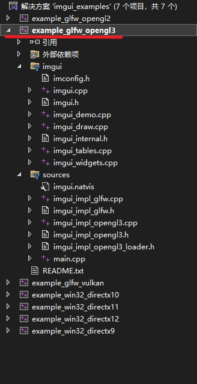
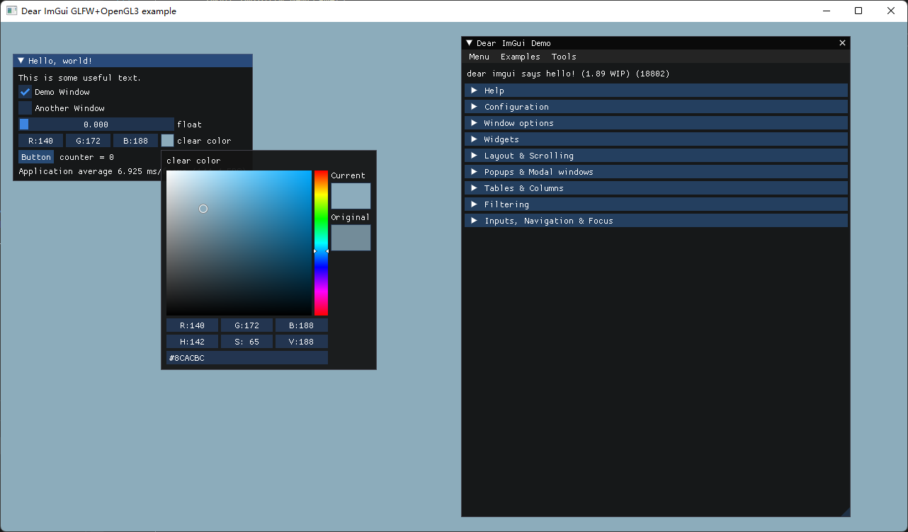
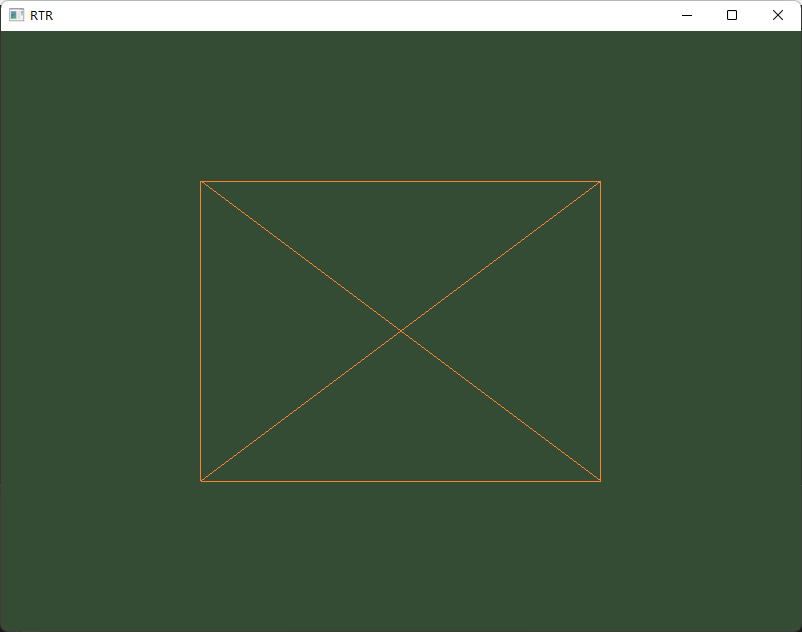
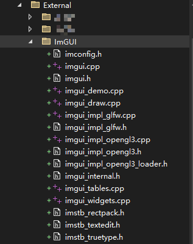
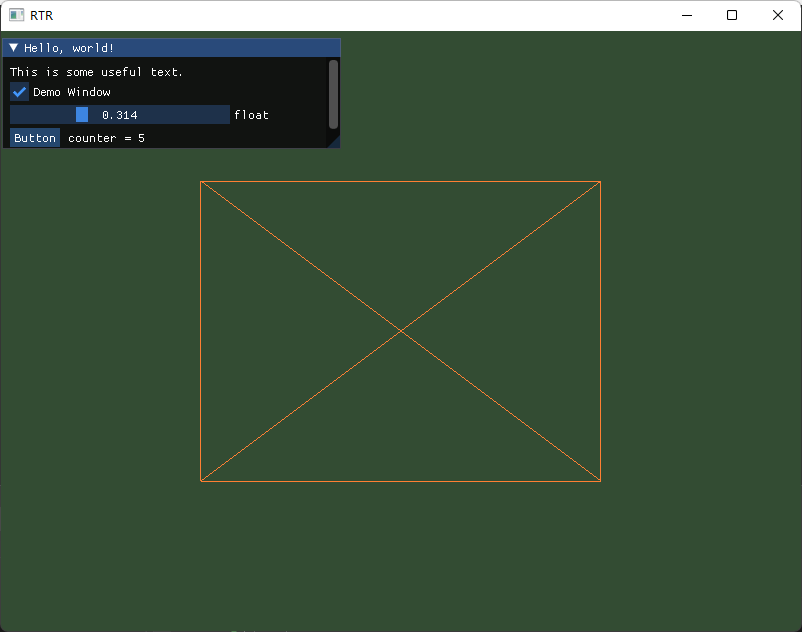

### ImGUI的简单使用

[ImGUI](https://github.com/ocornut/imgui)属于即插即用的库，不需要生成或者编译

> **The core of Dear ImGui is self-contained within a few platform-agnostic files** which you can easily compile in your application/engine. They are all the files in the root folder of the repository (imgui*.cpp, imgui*.h).
> 
> **No specific build process is required**. You can add the .cpp files to your existing project.

所以我们只需要把相应的文件加入我们的工程即可。

这里除了上面说的imgui*.cpp, imgui*.h文件外，我们还需要一个后端

> You will need a backend to integrate Dear ImGui in your app. The backend passes mouse/keyboard/gamepad inputs and variety of settings to Dear ImGui, and is in charge of rendering the resulting vertices. **Backends for a variety of graphics api and rendering platforms** are provided in the [backends/](https://github.com/ocornut/imgui/tree/master/backends) folder, along with example applications in the [examples/](https://github.com/ocornut/imgui/tree/master/examples) folder. See the [Integration](https://github.com/ocornut/imgui#integration) section of this document for details. You may also create your own backend. Anywhere where you can render textured triangles, you can render Dear ImGui.

我们就直接用ImGUI给的后端就行了。

下面以GLFW和OpenGL的上下文为例展示如何在我们的代码中插入ImGUI。

--- 

##### 确定我们需要的文件

首先我们要确定我们到底需要哪些文件，这里我们可以通过运行ImGUI给的example看看哪些文件被用到了。

下载ImGUI的全部代码，直接打开`example/imgui_examples.sln`，可以看到我们的目标emample_glfw_opengl3和它用到的文件，sources中的文件都在`backends/`里，imgui中的文件就在ImGUI的根目录下。



这个example运行的效果是这样的



--- 

##### 回到我们自己的项目

之前我们已经实现了绘制一个立方体（[ver0.21](../Readme.md)）（图中以线框模式渲染，坐标未转换，只能看到正面和背面的叠加），现在来加入ImGUI



首先把刚刚说的文件都引入进来（这种第三方库的文件该怎么管理比较好我现在也不懂，就先这样放了，能用就行）



然后代码部分都可以直接参考/照抄example的main函数，就是在原来OpenGL渲染的pipeline中加入ImGUI的部分，主要就是主循环前的初始化和主循环中的渲染。

引入头文件，这里就和example的main.cpp是一样的，引入ImGUI相关的文件

```cpp
// ImGUI
#include "External/ImGUI/imgui.h"
#include "External/ImGUI/imgui.h"
#include "External/ImGUI/imgui_impl_glfw.h"
#include "External/ImGUI/imgui_impl_opengl3.h"
```

然后是各种初始化和设置

```cpp
// Setup Dear ImGui context
IMGUI_CHECKVERSION();
ImGui::CreateContext();
ImGuiIO& io = ImGui::GetIO(); (void)io;
//io.ConfigFlags |= ImGuiConfigFlags_NavEnableKeyboard;     // Enable Keyboard Controls
//io.ConfigFlags |= ImGuiConfigFlags_NavEnableGamepad;      // Enable Gamepad Controls

// Setup Dear ImGui style
ImGui::StyleColorsDark();
//ImGui::StyleColorsClassic();

// Setup Platform/Renderer backends
ImGui_ImplGlfw_InitForOpenGL(window, true);
ImGui_ImplOpenGL3_Init("#version 130");    //这里的参数应该是glsl_version, windows下就是#version 130
```

然后在主循环中创建Frame并渲染，在example中还展示了新的子窗口以及其他组件，这里我们先不看，只引入其中滑条，按键，勾选框这些功能。

```cpp
// Start the Dear ImGui frame
ImGui_ImplOpenGL3_NewFrame();
ImGui_ImplGlfw_NewFrame();
ImGui::NewFrame();
{
    static float f = 0.0f;
    static int counter = 0;

    ImGui::Begin("Hello, world!");                          // Create a window called "Hello, world!" and append into it.

    ImGui::Text("This is some useful text.");               // Display some text (you can use a format strings too)

    bool show_demo_window;
    ImGui::Checkbox("Demo Window", &show_demo_window);//Demo窗口部分没有引入，所以这里的show_demo_window变量只单纯的占位

    ImGui::SliderFloat("float", &f, 0.0f, 1.0f);            // Edit 1 float using a slider from 0.0f to 1.0f
    //ImGui::ColorEdit3("clear color", (float*)&clear_color); // Edit 3 floats representing a color
    //这里用了一个ImGUI定义的数据类型,所以先注释掉    

    if (ImGui::Button("Button"))                            // Buttons return true when clicked (most widgets return true when edited/activated)
        counter++;
    ImGui::SameLine();
    ImGui::Text("counter = %d", counter);

    ImGui::Text("Application average %.3f ms/frame (%.1f FPS)", 1000.0f / ImGui::GetIO().Framerate, ImGui::GetIO().Framerate);
    ImGui::End();
}
ImGui::Render();
ImGui_ImplOpenGL3_RenderDrawData(ImGui::GetDrawData());
```

运行


