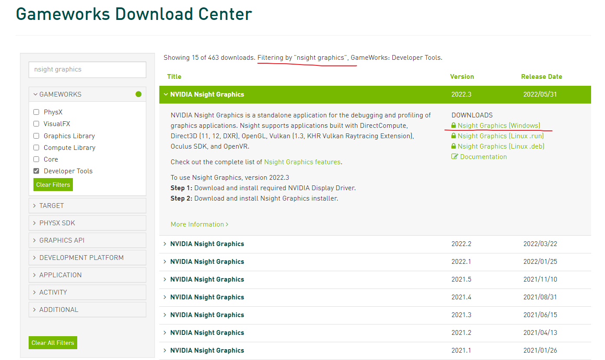
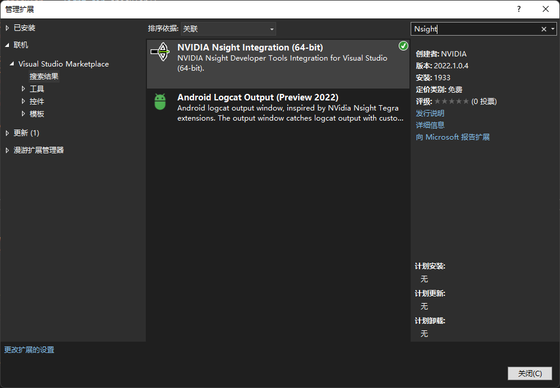
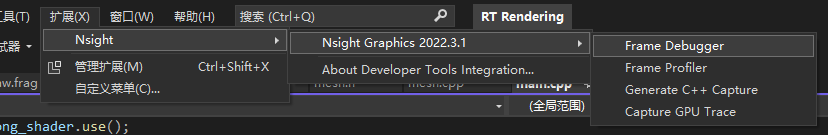
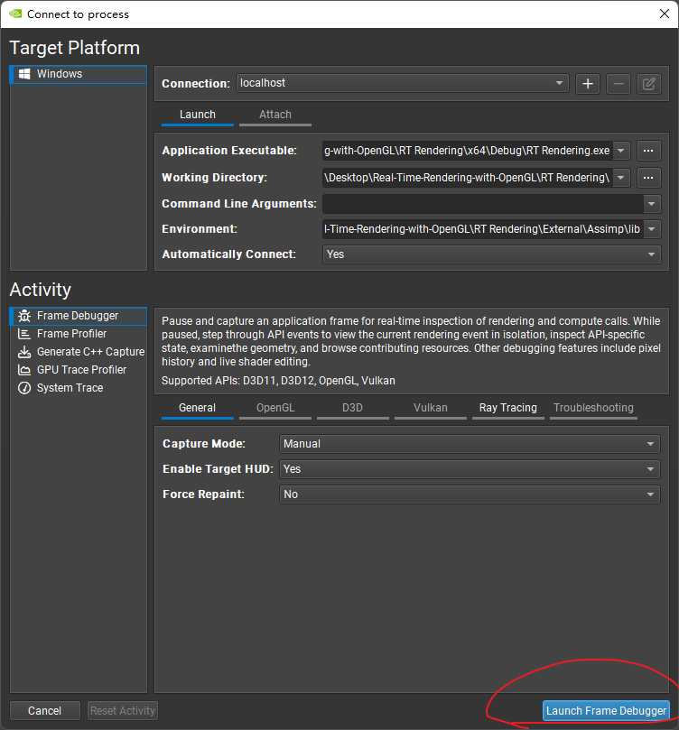
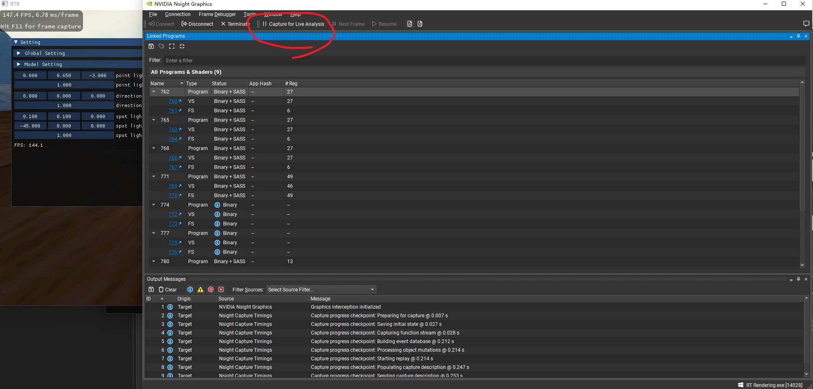
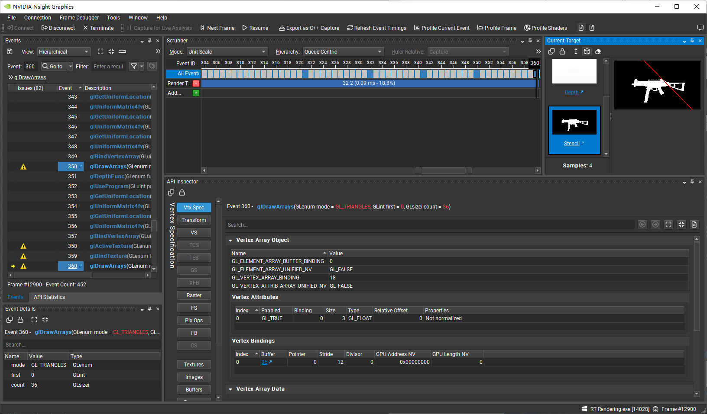

### Nsight Graphics 的简单安装使用

环境：Windows11, Visual Studio 2022

安装：[Nvida官网](https://developer.nvidia.com/gameworksdownload)搜索下载安装Nsight Graphics（需要注册Nvida）

VS安装插件

启动调试：这里可能需要管理员权限才能解锁部分功能，按照[官方文档](https://developer.nvidia.com/nvidia-development-tools-solutions-err-nvgpuctrperm-nsight-graphics)的提示设置即可

单帧内调试

这个窗口里能发掘的东西就比较多了，比如可以看到深度缓冲和模板缓冲中的内容，我也还在学习中

参考资料：

[调试 - LearnOpenGL CN (learnopengl-cn.github.io)](https://learnopengl-cn.github.io/06%20In%20Practice/01%20Debugging/#_8)

[GLSL 调试技巧入门](https://www.shangyexinzhi.com/article/4661883.html)

[NVIDIA Development Tools Solutions - ERR_NVGPUCTRPERM: Nsight Graphics Permission issue with Performance Counters | NVIDIA Developer](https://developer.nvidia.com/nvidia-development-tools-solutions-err-nvgpuctrperm-nsight-graphics)
