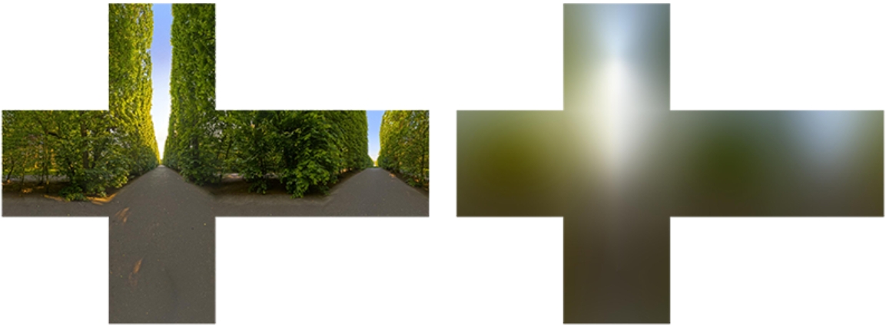

# PBR的一个简单实现 - 环境光（间接光）部分

基于物理的渲染（Physically Based Rendering , PBR）。它不是某一个确定的解决方案，而是一个研究方向，里面的各部分细节都会随着图形学的发展不断更新。这篇文章不会涉及太多理论，也不会讲公式怎么来的，单纯给出PBR的一个简单的确定的解决方案（OpenGL+GLSL），（相对）快速地得到一个渲染结果。


上一篇文章完成了直接光的部分，但其实只包含直接光的PBR并没有比之前的着色模型提升太多，环境光才是关键的地方。环境光我们一般使用立方体贴图表示，也就是基于图像的光照：

> 基于图像的光照(Image based lighting, IBL)是一类光照技术的集合... IBL 通常使用（取自现实世界或从3D场景生成的）环境立方体贴图 (Cubemap) ，我们可以将立方体贴图的每个像素视为光源。


直接光部分中我们给出了这样一个比较直白的公式：
$$
L_o=(\text{diffuse}+\text{specular})*\text{lightStrength}
$$
这个公式应该被称为反射方程，原始公式如下：
$$
L_o(p,\omega_o) = \int\limits_{\Omega} 
        (k_d\frac{c}{\pi} + k_s\frac{DFG}{4(\omega_o \cdot n)(\omega_i \cdot n)})
        L_i(p,\omega_i) n \cdot \omega_i  d\omega_i
$$
这里我们不会详细讲解这个公式，请自行查阅其他讲解PBR理论的参考资料。

直接光中我们是直接求解，但是环境光部分我们真的就需要积分了（因为环境光中有无数个光源，无数个光照方向和光照强度），当然实时渲染中求解积分肯定是不现实的，所以IBL主要思路就是使用数学化简/近似将积分部分（光照方向和光照强度）提取出来，在渲染开始前进行预计算，这样在渲染中就只需要使用预计算的结果和视线方向，法向量等变量进行简单的计算即可。

具体的数学计算请参考这篇文章 [深入理解 PBR/基于图像照明 (IBL) - 知乎 (zhihu.com)](https://zhuanlan.zhihu.com/p/66518450)，本文只会给出少量的讲解和结果。

上面的反射方程表示的意思是某一点 $p$ 沿方向 $\omega_o$ 的出射光线，我们在片段着色器中计算时 $p$ 这个点是确定的，所以我们要求的就是：
$$
L_o(\omega_o) = \int\limits_{\Omega}         (k_d\frac{c}{\pi} + k_s\frac{DFG}{4(\omega_o \cdot n)(\omega_i \cdot n)})        L_i(\omega_i) n \cdot \omega_i  d\omega_i
$$
这个方程在视线方向 $v$ 的解 $L_o(v)$。

同样我们分别讨论漫反射部分和镜面反射部分。


### 1. 环境光 - 漫反射

漫反射部分为
$$
L_d(\omega_o) = \int\limits_{\Omega} k_d\frac{c}{\pi} L_i(\omega_i) n \cdot \omega_i  d\omega_i
$$
因为 $k_d$ 的计算用到了菲涅尔系数 $F$ 不能提出来，所以这里对 $k_d$ 做一个近似 $k_d^*$，最后结果为：
$$
L_d(\omega_o) =  k_d^*\frac{c}{\pi}\int\limits_{\Omega} L_i(\omega_i) n \cdot \omega_i  d\omega_i
$$
其中
$$
k_d^*=(1-F_{roughness}(n, \omega_o))(1-metalness)
$$

$$
F_{roughness}(n, \omega_0)=F_0+(\text{max}\{1-roughness,F_0\}-F_0)(1-n\cdot\omega_o)^5
$$

（这里的 $F$ 是用法线方向 $n$ 计算的，直接光部分我们是用半向量 $h$ 计算的，也有都用 $n$ 计算的情况，应该是使用的不同的模型，具体我也没有弄清楚，暂时先不纠结这个区别）

积分部分 $\int\limits_{\Omega} L_i(\omega_i) n \cdot \omega_i  d\omega_i$ 这里不讲解具体的计算，看一下积分的结果：

 

左：环境光贴图；右：积分后的结果；图片来源[LearnOpenGL](https://learnopengl-cn.github.io/07 PBR/03 IBL/01 Diffuse irradiance/#_1)

积分结果的cubemap也被称为irradiance map（辐照度图），我们用法线方向 $n$ 进行采样即可。


### 2. 环境光 - 镜面反射


镜面反射部分为
$$
L_s(\omega_o) = \int\limits_{\Omega}         k_s\frac{DFG}{4(\omega_o \cdot n)(\omega_i \cdot n)}      L_i(\omega_i) n \cdot \omega_i  d\omega_i
$$
这部分可就太麻烦了，直接放化简后的近似解：
$$
L_s(\omega_o) = L_c^*(R)*(F_0*\text{scale}+\text{bias})
$$
其中 $R$ 为视线方向的反射$\text{reflect}(-\omega_0,n)$，$L_c^*(R)$ 与粗糙度roughness有关，所以我们计算多个roughness下的结果并保存为mipmap，这个贴图被称为预滤波环境贴图（pre-filtered environment map）。同样我们先忽略这个mipmap是如何计算出来的。

 


图片来源[LearnOpenGL](https://learnopengl-cn.github.io/07 PBR/03 IBL/02 Specular IBL/)

scale和bias是仅关于**视线-法线夹角 $\theta$ 和粗糙度**的函数，函数由BRDF的具体实现决定，所以我们用一个二通道贴图储存scale和bias的预计算结果：

 

图片来源[LearnOpenGL](https://learnopengl-cn.github.io/07 PBR/03 IBL/02 Specular IBL/)

这张图通常被称为BRDF积分贴图（BRDF integration map），使用时以 $\cos \theta$ 为横坐标，roughness为纵坐标，采样得到的R通道的值为scale，G通道值为bias。


### 3. 代码实现

在忽略辐照度图（irradiance map），预滤波环境贴图（pre-filtered environment map），BRDF积分贴图（BRDF integration map）的预计算的情况下代码部分是比较简单的，这三个贴图的计算方法我暂时也不会，想自己计算的可以参考LearnOpenGL相关章节和[深入理解 PBR/基于图像照明 (IBL) - 知乎 (zhihu.com)](https://zhuanlan.zhihu.com/p/66518450)。现在我们使用现成的工具[cmftStudio](https://github.com/dariomanesku/cmftStudio)直接获得。

有几点需要单独说明一下：

1. 我们获得的贴图统一使用等距柱状投影图(Equirectangular Map，也有叫LatLong的) 进行存储，网上能找到的美术素材也大多使用等距柱状投影图存储。所以我们需要写一个工具函数将Equirectangular Map转化为Cube Map，代码可参考[LearnOpenGL](https://learnopengl-cn.github.io/07 PBR/03 IBL/01 Diffuse irradiance/#_1)。
2. cmftStudio导出预滤波环境贴图（pre-filtered environment map）时只能导出LOD=0（也就是粗糙度为0的贴图），现在为了快速得到一个结果我们直接使用openGL的glGenerateMipmap生成其他LOD的贴图，这个效果在粗糙度较高时是**非常非常差**的，后续我们再研究如何得到正确的预滤波环境贴图（可能还是需要手动写代码完成这些贴图的预计算）。


然后开始在直接光部分的基础上修改着色器代码。

首先是确定我们需要的纹理贴图：

``` glsl
// IBL
uniform samplerCube irradianceMap;
uniform samplerCube prefilterMap;
uniform sampler2D brdfLUT;
```

然后计算新的漫反射系数 $k_d^*$ ： 

``` glsl 
vec3 KD_star(vec3 v, vec3 n, vec3 f0, float alpha, float m){

    float vn=max(dot(v, n), 0.0);
    vec3 fr = f0 + (max(vec3(1-alpha),f0)-f0)*pow(1-vn,5);
    return (1-fr)*(1-m);
}
```

计算镜面反射时我们还需要视线反射方向：

``` glsl
vec3 reflect_view = reflect(-view_dir,norm);
```

把所有东西拼起来：

``` glsl
vec3 diffuse_ibl = KD_star(view_dir,norm,F0,roughness,metallic) * albedo / PI * texture(irradianceMap,norm).rgb;

vec4 lut_val = texture(brdfLUT,vec2(max(dot(norm, view_dir), 0.0), roughness));
vec3 specular_ibl = textureLod(prefilterMap, reflect_view, roughness * 9.0f).rgb * (F0 * lut_val.r + lut_val.g); // 这里的9.0f是因为我们的prefilterMap尺寸是512x512，glGenerateMipmap会生成到第9层

FragColor = FragColor + vec4(diffuse_ibl + specular_ibl,1.0);
```

结果：


左：粗糙度为0；下：金属度为0；

可以看到粗糙度较高时因为没有使用正确的预滤波环境贴图（pre-filtered environment map）而出现硬分界，原因很简单，我们将Equirectangular Map转化为Cube Map时是分别渲染6个方向的结果，直接使用glGenerateMipmap只会分别在6个方向进行下采样，而正确的预滤波环境贴图会从全部的方向上采样，不会出现这样的边界。之后我们再研究如何得到正确的预滤波环境贴图。


### 4. 修点BUG

上一节中的图还有一点小bug，每个球中心会有一个奇怪的圆圈，这是因为使用的BRDF LUT的图片有点问题，所以我们还是自己积分生成一下，再加上辐照度图（irradiance map），预滤波环境贴图（pre-filtered environment map），我们需要写3个着色器来生成这些贴图，因为涉及到积分公式的推导、通过采样进行积分求解、和随机采样序列的生成，这些我也还没完全弄懂，所以着色器代码直接复制粘贴[LearnOpenGL](https://learnopengl.com/code_viewer_gh.php?code=src/6.pbr/2.2.1.ibl_specular/ibl_specular.cpp)的，暂时也不进行讲解。


现在效果好多了。

然后加入基础颜色贴图，法线贴图，金属度和粗糙度贴图：

 

 

 

完事。


参考资料：

[漫反射辐照 - LearnOpenGL CN (learnopengl-cn.github.io)](https://learnopengl-cn.github.io/07 PBR/03 IBL/01 Diffuse irradiance/#_1)

[镜面IBL - LearnOpenGL CN (learnopengl-cn.github.io)](https://learnopengl-cn.github.io/07 PBR/03 IBL/02 Specular IBL/)

[深入理解 PBR/基于图像照明 (IBL) - 知乎 (zhihu.com)](https://zhuanlan.zhihu.com/p/66518450)

[Code Viewer. Source code: src/6.pbr/2.2.1.ibl_specular/ibl_specular.cpp (learnopengl.com)](https://learnopengl.com/code_viewer_gh.php?code=src/6.pbr/2.2.1.ibl_specular/ibl_specular.cpp)

HDR素材：

[NoEmotion HDRs](http://noemotionhdrs.net/hdrevening.html)

http://www.hdrlabs.com/sibl/archive.html

