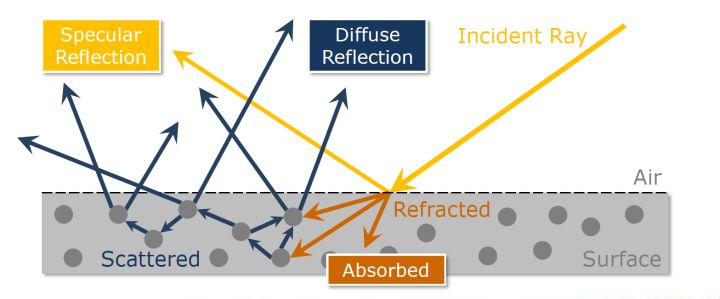
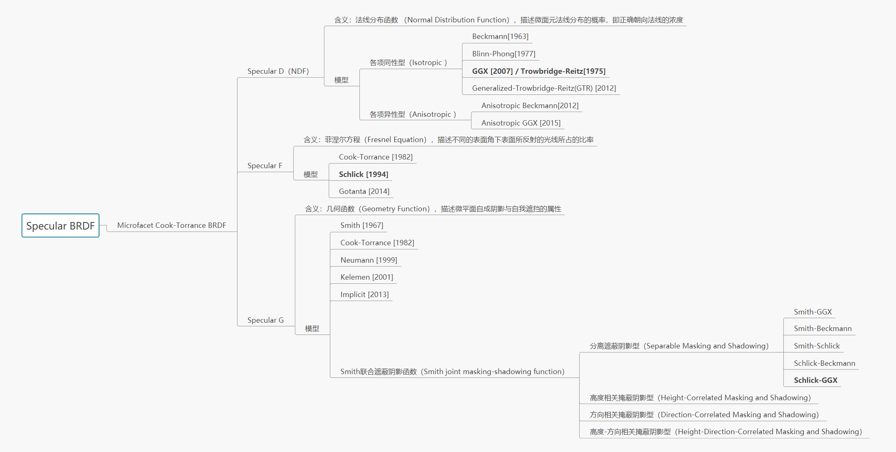
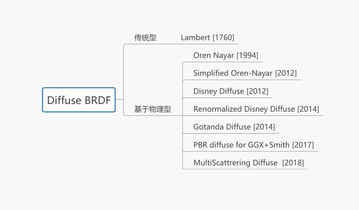
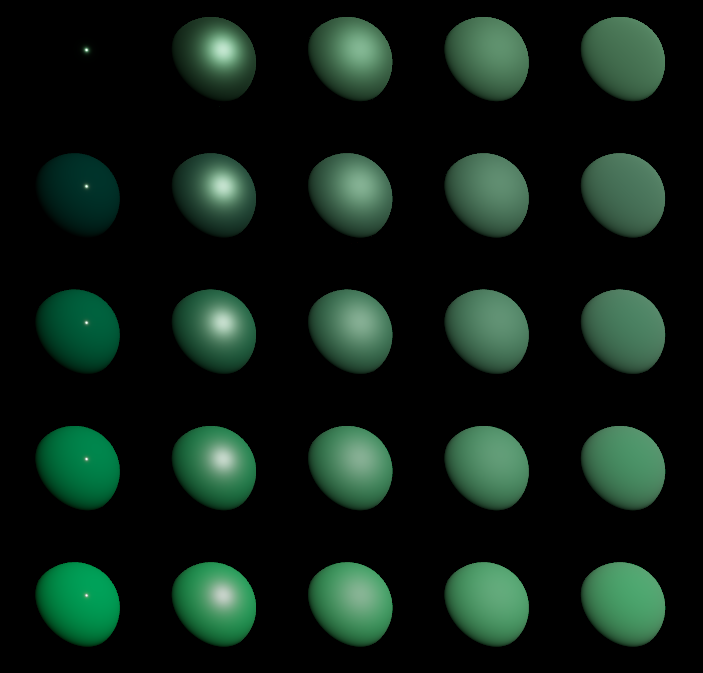
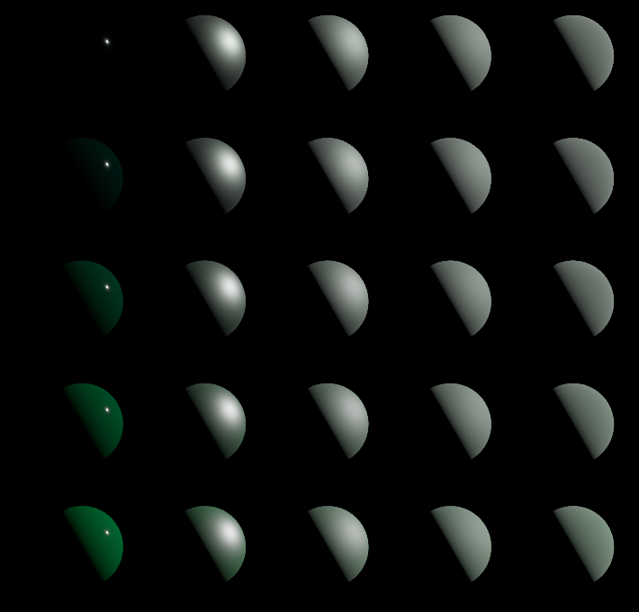

# PBR的一个简单实现 - 直接光部分

基于物理的渲染（Physically Based Rendering , PBR）。它不是某一个确定的解决方案，而是一个研究方向，里面的各部分细节都会随着图形学的发展不断更新。这篇文章不会涉及太多理论，也不会讲公式怎么来的，单纯给出PBR的一个简单的确定的解决方案（OpenGL+GLSL），（相对）快速地得到一个渲染结果。


但是为了整体逻辑的连贯性，还是简单提两个理论：

1. 微平面理论

> 项理论认为，达到微观尺度之后任何平面都可以用被称为微平面(Microfacets)的细小镜面来进行描绘。根据平面粗糙程度的不同，这些细小镜面的取向排列可以相当不一致


图片来源[LearnOpenGL](https://learnopengl-cn.github.io/07 PBR/01 Theory/#brdf)，看这个图基本就能理解了。

2. 能量守恒



图片来源[毛星云知乎文章](https://zhuanlan.zhihu.com/p/56967462)，为光与物体表面的交互图示。这里的表面应该指的是宏观表面而不是微表面，所以微平面理论算是对这张图中各种类型的光的产生的一种解释（个人理解）。


其余的理论部分就不复读了，可以参考知乎上[毛星云大佬系列文章](https://zhuanlan.zhihu.com/p/53086060)，可以看作是一个综述吧，值得一看。

和之前的渲染一样，我们分别讨论直接光和环境光（间接光），它们又分为漫反射部分和镜面反射部分（还有一部分光直接被材料吸收），我们先看直接光的部分：
$$
L_o=(\text{diffuse}+\text{specular})*\text{lightStrength}
$$
lightStrength表示在某一点处表面接受到的光照强度，或者说辐照度(Irradiance)，通常为$\text{lightColor}*(\text{normal}\cdot \text{lightDir})*\text{lightPower}$，对于点光源和聚光，我们还要考虑距离的衰减，对应聚光还要考虑内外环的衰减。现在我们要做的就是求出从摄像机方向看过去，漫反射和镜面反射的光分别占接受到的光照的比例。


### 1. 直接光 - 镜面反射

首先是直接光镜面反射部分，也是公式比较多的一项。

> 游戏业界目前最主流的基于物理的镜面反射BRDF模型是基于微平面理论（microfacet theory）的Microfacet Cook-Torrance BRDF。

Cook-Torrance BRDF中的镜面反射部分为：
$$
f(l,v)=\frac{D(h)F(v,h)G(l,v,n)}{4(n\cdot l)(n\cdot v)}
$$
其中：

$n$ ：表面法线

$l$ ：接受光的（反）方向

$v$ ：视图方向

$h$ ：半矢量（$l$  和 $v$ 的中间向量，Blinn-Phong Shading中介绍过）

$D(\cdot)$： 法线分布函数 （Normal Distribution Function），描述微表面法线的分布

$F(\cdot)$： 菲涅尔方程（Fresnel Equation），描述镜面反射光线的所占的比例

$G(\cdot)$：几何函数（Geometry Function），描述微平面对自身的遮挡（毛星云原文中$G$项的参数是$l$，$v$，$h$，但实际公式中没有用到$h$而是用了$n$）

分母部分可以理解为一个归一化因子


然后依次讨论$D(h)$，$F(v,h)$，$G(l,v,n)$三项。



图片来自[毛星云](https://zhuanlan.zhihu.com/p/53086060)，加粗部分为目前（2018年）的主流实现。


#### 1.1 法线分布函数 D

> 其中，业界较为主流的法线分布函数是GGX（Trowbridge-Reitz）

$$
D_{GGX}(h)=\frac{\alpha^2}{\pi((n\cdot h)^2(\alpha^2-1)+1)^2}
$$

其中 $\alpha \in [0,1]$ 表示表面的粗糙度。

这个函数描述了微平面的法线的分布，粗糙度越大，微平面法线分布越分散。简单分析一下这个函数，当粗糙度一定时，半矢量$h$和表面法线$n$越近，$D$ 越大，也就是镜面反射值越大，这和Blinn-Phong是一致的。当半矢量$h$确定时，粗糙度越大，D越小，也就是微平面法线分布在半矢量$h$附近的比例越少。


#### 1.2 菲涅尔方程 F

> 业界方案一般都采用Schlick的Fresnel近似，因为计算成本低廉，而且精度足够

$$
F_{schlick}(v,h)=F_0+(1-F_0)(1-(v\cdot h)^5)
$$

这一项存在的原因是菲涅尔效应（Fresnel effect）：视线与表面夹角越小，光的反射率越高（即发生镜面反射的光更多，被漫反射/吸收的光越少）。$F_0$即菲涅尔反射率，指垂直平面入射的光的反射率，实际使用是一般是一个3维向量，分别控制RGB。


#### 1.3 几何函数 G

> 其中UE4的方案是上面列举中的“VEC” 

$$
G(l,v,n)=G_{SchlickGGX}(n,v)\cdot G_{SchlickGGX}(n,l)
$$

这一项表示微平面对光线的遮挡

> 粗糙度较高的表面其微平面间相互遮蔽的概率就越高

其中
$$
G_{SchlickGGX}(n,x)=\frac{n\cdot x}{(n\cdot x)(1-k)+k}
$$
在**直接光照**中
$$
k=(\alpha +1)^2/8
$$
其中 $\alpha \in [0,1]$ 表示表面的粗糙度。

$G_{SchlickGGX}(n,x)$表示$x$方向上**未**被微平面遮挡的光线的比例，我们同时考虑到观察方向和入射光方向，所以最后结果是两项相乘（Smith’s method）。


### 2. 直接光 - 漫反射

 

这里我们选择Lambert模型，[LearnOpenGL](https://learnopengl-cn.github.io/07 PBR/02 Lighting/)和[Unity](https://zhuanlan.zhihu.com/p/68025039)也是如此。
$$
diffuse=\frac{c}{\pi}*(1-F)*(1-m)
$$
其中 $c$ 表示表面颜色（或者说反照率albedo），$\pi$ 是一个归一项保证能量守恒，镜面光部分我们求出了反射率$F$，所以留给漫反射的就是 $(1-F)$  ，$m\in [0,1]$ 表示表面的金属度，这一项存在是因为

> 金属会立即吸收任何透射光，因此它们不会出现任何次表面散射或透明感。

所以金属的漫反射部分是0。


### 3. 代码实现

先以平行光（directed light）为例进行实现，确定一下计算需要的参数：

首先是一些方向向量：

``` glsl
vec3 norm = normalize(VertNormal);
vec3 light_dir = - normalize(dir_light.dir); // 光源的属性放在一个结构体中
vec3 view_dir = normalize(camera_pos-VertPos); // 如果是正交相机就要用相机（反）方向而不是位置坐标的差
vec3 halfway_dir = normalize(light_dir+view_dir);
```

然后是这个片段上接受的光照强度：

``` glsl
vec3 radiance = dir_light.color * dir_light.power * dot(norm ,light_dir);
```

然后是物体的材质：

``` glsl
uniform vec3  albedo; // 也就是基础颜色
uniform float roughness;
uniform float metallic;
```

关于菲涅尔反射率$F_0$，不同材料的菲涅尔反射率都不一样，这里我们设定金属的反射率和表面颜色相同$F_0=albedo$，非金属反射率为(0.04, 0.04, 0.04)，中间的材质根据金属度插值得到。

``` glsl
vec3 F0 = mix(vec3(0.04f), albedo, metallic);
```

然后用这些参数计算DFG：

``` glsl
float DGGX(vec3 n,vec3 h, float alpha){
    
    float a2=alpha*alpha;
    float nh=max(dot(n, h), 0.0);
    float b=nh*nh*(a2-1)+1;
    return a2/(PI*b*b);
}

vec3 FSchlick(vec3 v,vec3 h, vec3 f0){
    
    float vh=max(dot(v, h), 0.0);
    return f0+(1-f0)*(1-pow(vh,5));
}

float GSchlickGGX(vec3 n, vec3 x, float k){
    
    float nx=max(dot(n, x), 0.0);
    return nx/(nx-k*nx+k);
}

float GSmith(vec3 l, vec3 n, vec3 v,float alpha){
    
    float k=(alpha+1)*(alpha+1)/8;
    return GSchlickGGX(n,l,k)*GSchlickGGX(n,v,k);
}
```

然后把漫反射和镜面反射都拼起来：

``` glsl
float D=DGGX(norm,halfway_dir,max(roughness,0.002)); //这里让粗糙度不会低于0.002，因为法线分布函数在alpha等于0处不连续，会让出现D=0的情况导致整个镜面反射系数为0
vec3 F=FSchlick(view_dir,halfway_dir,F0);
float G=GSmith(light_dir,norm,view_dir,roughness);

vec3 diffuse = albedo/PI * (vec3(1.0)-F) * (1-metallic);
vec3 specular = D*F*G/(4*max(dot(norm,light_dir),0.0001)*max(dot(norm,view_dir),0.0001));

FragColor = vec4((diffuse + specular) * radiance,1.0);
```

结果：

 

左：粗糙度为0；下：金属度为0；


#### 一点问题

虽然公式都是对的但是当光照与观察方向偏离锐角的时候结果看起来怪怪的，金属度较大的材质颜色会偏向灰色, 个人分析是：1. 金属度较大时漫反射较小，2. 光照与观察方向夹角变大会使F项趋近于（1，1，1）。这两点导致材质失去原有的彩色。这个情况是否是合理的暂时不清楚，以后学习过程中再注意。

 


参考资料：

[【基于物理的渲染（PBR）白皮书】- 知乎 (zhihu.com)](https://zhuanlan.zhihu.com/p/53086060) 这一系列的文章

[理论 - LearnOpenGL CN (learnopengl-cn.github.io)](https://learnopengl-cn.github.io/07 PBR/01 Theory/#brdf)

[如何在Unity中造一个PBR Shader轮子 - 知乎 (zhihu.com)](https://zhuanlan.zhihu.com/p/68025039)
