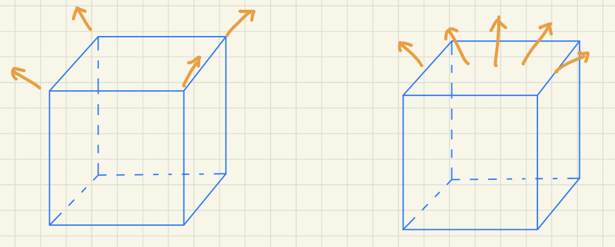
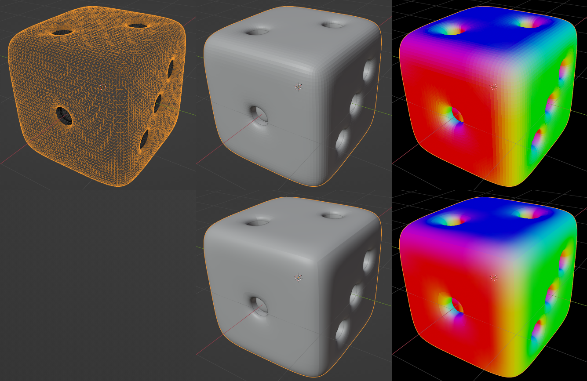

### 立方体的法线

渲染过程中OpenGL（包括其他API）默认使用面片的顶点属性将面片内部的点的属性插值出来。

和纹理一样，一个顶点会被几个面所共用，我们没办法兼顾到所有的面，如果顶点法线这样设置：

很明显一个面上的法线方向会是不断变化的，而我们希望一个面上的法线能和真实的法线一致。

**这里强调一下，我们希望一个面上所有点的法线一样，而不是一个面上所有点的最终渲染结果一样。** 也就是说，我们的目标是在每个点（fragment）渲染时，能够得到真实的法线而不是插值得到的法线。

以下是几种解决方案：

1. 拆点，最简单直接的做法。

2. 在几何着色器（Geometry Shader）中计算三角片面的法向量，因为几何着色器的输入是图元（点，线段，或者三角形），所以自然能通过三角形的三个顶点坐标计算出法线（一个面具有两个相反的法线方向，所以要求整个mesh的三角形的三个点具有相同的顺序，通常为逆时针方向，一般的建模软件都会注意到这点）。

3. 在片段着色器中计算相机空间中的dFdx/dFdy。这个方法我暂时不懂，请自行查看参考资料。
   
   &nbsp;

这里我们顺便再讲一下**平滑着色（smooth shading）** 和 **平直着色（flat shading）**。

平滑着色是默认的着色方式，使用面片的顶点属性将面片内部的点的属性插值出来，而平直着色是使用面片的一个点的渲染结果作为整个面片的渲染结果（整个面片是最终渲染结果相同，所以平直着色**不能**作为立方体法线的解决方案，即使在平直着色中一个片面具有相同的法线）。

这张图展示了一个模型的线框，平直着色，平直着色法线，平滑着色，平滑着色法线。（在平滑着色中也有一些硬边缘，这是顶点拆分的结果）

参考资料：

[opengl - How to get flat normals on a cube - Stack Overflow](https://stackoverflow.com/questions/14980712/how-to-get-flat-normals-on-a-cube)

[Access to triangle normals, rather than vertex - OpenGL - Khronos Forums](https://community.khronos.org/t/access-to-triangle-normals-rather-than-vertex/55363/6)

[OpenGL4.0】GLSL-Flat Shading平面着色_编程学习指南的博客-CSDN博客_glsl 平面着色](https://blog.csdn.net/xiajun07061225/article/details/7660810/)
