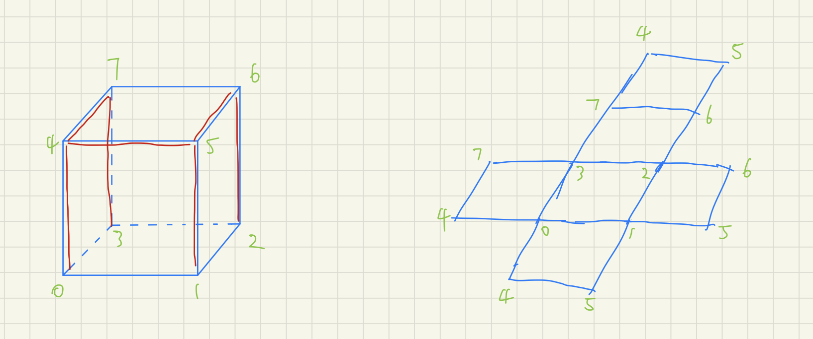

### OpenGL 纹理（Texture）中的多uv坐标

将一个2D图片投影到3D模型上，我们需要知道3D模型上每一个顶点在2D图片上对应的位置，也就是UV坐标（在LearnOpenGL 也叫纹理坐标）。所以在渲染时，一个顶点除了有空间坐标xyz，还有纹理坐标uv。

然而在把3D模型进行UV展开时，可以看到焊缝/缝合线处的顶点都会有多个对应的uv坐标，具体使用哪一个取决于渲染的三角片面。

LearnOpenGL中关于纹理的这一节中使用的是一个正方形（两个三角片面），所以不存在这个问题，在之后的正方体的渲染中也没有使用EBO（Element Buffer Object）（也就是使用了三角面片数量x3的顶点），所以每个顶点也只有一个uv坐标。

找了一圈后**发现这种多个uv坐标（multiple UV coordinates）的标准解决方案就是拆点**，将uv缝合线上的点拆成多个，使每个点只对应一个uv坐标。

开始时我有一种想法，EBO描述了每个三角面片的三个顶点的index，如果能额外使用一个EBO来描述每个三角面片的三个顶点所使用的uv坐标的index（将所有可能uv坐标都放进顶点的属性中），这个问题就解决了。但是实际情况是一个合理的uv展开并不会生成过多的缝合线，需要拆分的顶点永远是少数（除了这个立方体一样只有个位数顶点），相比之下一个额外的EBO带来的开销将会大得多。

在一些工业建模中需要保证模型是闭合的实体而不是一个曲面，拆分是很危险的行为，但是在模型的渲染中，拆分并不会带来很大的影响，所以就拆吧。

参考资料：

[纹理 - LearnOpenGL CN (learnopengl-cn.github.io)](https://learnopengl-cn.github.io/01%20Getting%20started/06%20Textures/)

[opengl - How can I specify multiple UV coordinates for same vertexes with VAOs/VBOs? - Stack Overflow](https://stackoverflow.com/questions/36532924/how-can-i-specify-multiple-uv-coordinates-for-same-vertexes-with-vaos-vbos)

[c++ - Multiple Texture Coordinates Per Vertex (DirectX11) - Game Development Stack Exchange](https://gamedev.stackexchange.com/questions/132001/multiple-texture-coordinates-per-vertex-directx11)
